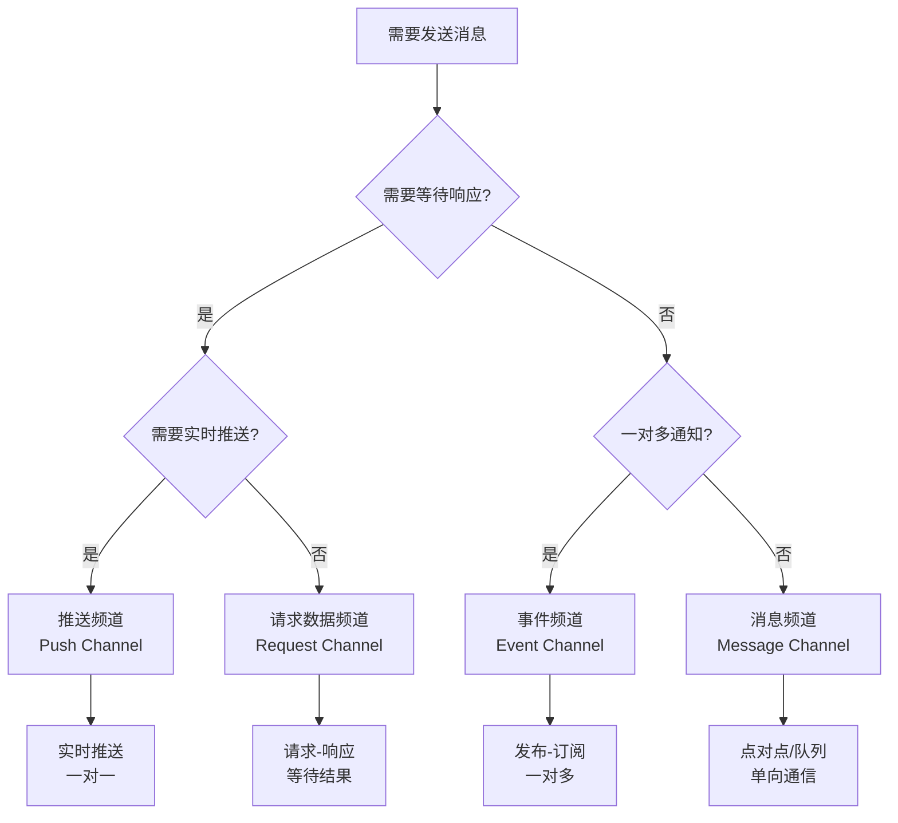

# 消息总线架构模式（Message Bus Architecture Pattern）

## 目录

- [概述](#概述)
- [核心概念](#核心概念)
- [架构结构](#架构结构)
- [消息总线包含的内容](#消息总线包含的内容)
- [设计规则](#设计规则)
- [优缺点分析](#优缺点分析)
- [实践指南](#实践指南)
- [与其他架构模式的关系](#与其他架构模式的关系)
- [应用场景](#应用场景)
- [实际案例](#实际案例)
- [设计原则](#设计原则)
- [总结](#总结)

---

## 概述

**消息总线架构模式**提供统一的消息传递基础设施，支持事件驱动、消息通讯、观察者模式等，实现组件解耦和异步通信。

**核心价值**：
- 统一接口：统一的消息发送和接收接口
- 系统解耦：组件通过消息总线通信，不直接依赖
- 异步处理：支持异步消息传递
- 可扩展性：轻松添加新的消息生产者和消费者

---

## 核心概念

**核心思想**：统一消息传递
- 统一接口：所有组件通过统一的消息总线接口通信
- 多种模式：支持事件驱动、消息通讯、观察者等
- 解耦设计：组件通过消息总线解耦
- 异步处理：消息传递和处理通常是异步的

---

## 架构结构

### 消息总线架构图

```
┌─────────────────────────────────────────────┐
│        消息生产者（Message Producer）         │
│   用户A、组件B、组件C                        │
│   创建消息，选择通讯方式（频道）              │
└─────────────────────────────────────────────┘
                    ↓ 委托消息总线
        ┌───────────────────────────┐
        │      消息总线              │
        │   (Message Bus)           │
        │  ┌─────────────────────┐  │
        │  │  消息路由和分发      │  │
        │  │  根据频道选择服务    │  │
        │  │  ┌────────────────┐ │  │
        │  │  │ 频道管理器     │ │  │
        │  │  │ (Channel Mgr)  │ │  │
        │  │  └────────────────┘ │  │
        │  └─────────────────────┘  │
        │  ┌─────────────────────┐  │
        │  │  频道服务（Channel） │  │
        │  │  ├─ 事件频道        │  │
        │  │  ├─ 消息频道        │  │
        │  │  ├─ 推送频道        │  │
        │  │  └─ 请求数据频道    │  │
        │  └─────────────────────┘  │
        └───────────────────────────┘
                    ↓ 通过频道服务处理
┌─────────────────────────────────────────────┐
│        消息消费者（Message Consumer）         │
│   用户B、组件Y、组件Z                        │
└─────────────────────────────────────────────┘
```

### 频道（Channel）概念

**频道（Channel）**是消息总线中的核心概念，它代表不同的通讯方式和服务类型。消息总线包含**四种核心频道**：

#### 四种核心频道

| 频道 | 模式 | 特点 | 用途 |
|------|------|------|------|
| **事件频道** | 发布-订阅 | 一对多，异步，不等待响应 | 事件通知（如订单创建） |
| **消息频道** | 点对点/队列 | 单向，异步，不等待响应 | 数据推送（PushData） |
| **推送频道** | 实时推送 | 一对一，实时推送 | 即时消息、状态更新 |
| **请求数据频道** | 请求-响应 | 一对一，等待响应 | 数据查询（QueryData） |

**频道选择决策树**：



**决策规则表**：

| 场景 | 频道选择 | 原因 |
|------|---------|------|
| 需要等待响应数据 | 请求数据频道 | 请求-响应模式 |
| 需要实时推送通知 | 推送频道 | 实时推送模式 |
| 一对多事件通知 | 事件频道 | 发布-订阅模式 |
| 单向数据推送 | 消息频道 | 点对点/队列模式 |

### 核心组件

- **消息总线（Message Bus）**：接收消息、路由分发、管理队列
- **消息生产者（Producer）**：产生消息，发送到总线
- **消息消费者（Consumer）**：订阅消息，处理业务逻辑
- **消息处理器（Handler）**：通过Handler映射机制处理特定类型消息

---

## 消息总线包含的内容

**消息总线 = 事件驱动 + 消息通讯 + 观察者模式**

| 模式 | 特点 | 实现 |
|------|------|------|
| **事件驱动** | 发布-订阅，一对多 | 事件频道 |
| **消息通讯** | 点对点/队列，单向 | 消息频道 |
| **观察者模式** | Handler映射，类型驱动 | ProcessDataHandler |

### 委托模式

**流程**：用户A → 创建消息 → 选择频道 → 委托消息总线 → 根据频道选择服务 → 通知用户B

```csharp
// 用户创建消息，选择频道
var message = new Message { Channel = ChannelType.Event };
messageBus.Send(message);

// 消息总线根据频道选择服务
public void Send(Message message) {
    var channel = _channelManager.GetChannel(message.Channel);
    channel.Send(message);
}
```


## 设计规则

### 核心规则

1. 统一接口：所有组件通过统一的消息总线接口通信
2. 多种模式：支持事件驱动、消息通讯、观察者等
3. 解耦设计：组件之间通过消息总线解耦
4. 异步处理：消息传递和处理通常是异步的

### 关键机制

| 机制 | 说明 |
|------|------|
| **作用范围** | 同进程/同主机/跨主机/跨数据中心 |
| **延迟** | 消息从发送到消费的时间 |
| **持久化** | 内存队列/磁盘队列/复制队列 |
| **分发策略** | 轮询分发/公平分发 |
| **优先级队列** | 高优先级消息优先处理 |
| **可靠性等级** | At most once / At least once / Exactly once |

### 消息优先级和顺序保证

| 场景 | 保证方式 |
|------|---------|
| 同一发送者 | 单线程处理，按发送顺序 |
| 不同发送者 | 时间戳排序 |
| 关键消息 | 优先级队列，高优先级先处理 |

### 消息持久化和可靠性

| 等级 | 说明 | 实现方式 |
|------|------|---------|
| At most once | 最多一次 | 内存队列 |
| At least once | 至少一次 | 磁盘队列 + 重试 |
| Exactly once | 恰好一次 | 磁盘队列 + 去重 |

### 错误处理和容错机制

| 错误类型 | 处理策略 |
|---------|---------|
| 消息丢失 | 持久化队列（磁盘队列） |
| 处理失败 | 重试机制（最多3次） |
| 超时 | 超时回调 |
| 频道不存在 | 降级处理（使用默认频道） |

### 消息设计原则

1. **消息类型定义**：定义清晰的消息类型，使用强类型，保持消息不可变
2. **Handler映射机制**：类型驱动的Handler映射，支持批量处理
3. **批量处理优化**：支持批量处理，优化性能

---

## 优缺点分析

### 优点
- **系统解耦**：组件不直接依赖，通过消息总线通信
- **异步处理**：提高响应性和吞吐量
- **可扩展性**：轻松添加新的生产者和消费者
- **统一管理**：统一管理消息路由、分发、处理
- **性能优化**：支持批量处理、异步处理、缓存

### 缺点
- **复杂性**：系统更复杂，调试困难，学习曲线陡
- **消息顺序**：可能乱序到达，需要处理因果关系
- **可靠性**：可能丢失或重复处理消息，故障恢复复杂
- **性能开销**：序列化、网络传输、处理延迟

---

## 实践指南

### 1. 实际实现与理论设计的映射

#### 当前实现（v1.0）

**DataHandleQueue 简化实现**：
```lua
DataHandleQueue (当前实现)
├── PushData() → 消息频道（简化版）
│   └── 直接存储到队列，不区分频道
├── ProcessQueryDelegate() → 请求数据频道（简化版）
│   └── 直接调用委托，同步返回
└── ProcessDataHandler() → Handler映射（观察者模式）
    └── 遍历handlers，调用处理函数
```

**特点**：
- 简单直接，易于理解
- 满足当前业务需求
- 为未来扩展预留接口

#### 未来演进（v2.0）

**完整消息总线实现**：
```lua
MessageBus (完整实现)
├── 频道管理器（Channel Manager）
│   ├── 事件频道（Event Channel）
│   ├── 消息频道（Message Channel）
│   ├── 推送频道（Push Channel）
│   └── 请求数据频道（Request Channel）
└── DataHandleQueue (适配器)
    ├── PushData() → 消息频道.Send()
    ├── QueryData() → 请求数据频道.Query()
    └── ProcessDataHandler() → Handler映射
```


### 2. 消息总线实现（频道机制）

**核心接口**：
```csharp
public interface IMessageBus {
    void Send(Message message);
    void Subscribe(string subscriberId, ChannelType channel, Action<Message> handler);
    void RegisterChannel(IChannel channel);
}

public class MessageBus : IMessageBus {
    private Dictionary<ChannelType, IChannel> _channels = new();
    public void Send(Message message) {
        _channels[message.Channel].Send(message);
    }
}
```

**频道实现要点**：
- **事件频道**：发布-订阅，一对多
- **消息频道**：点对点/队列，单向（PushData使用）
- **推送频道**：实时推送，一对一
- **请求数据频道**：请求-响应，等待结果（QueryData使用）

### 3. Handler映射机制（观察者模式）

**Handler映射机制**是DataQueueHandler中ProcessDataHandler的实现方式，它通过观察者模式自动路由数据到对应的Handler。

#### Handler注册
```csharp
// 注册不同类型的Handler（观察者模式）
var dataQueueHandler = new DataQueueHandler(messageBus);

// 注册Handler，当PushData时自动调用对应的Handler
dataQueueHandler.RegisterHandler<EquipmentData>(new EquipmentDataHandler());
dataQueueHandler.RegisterHandler<SkillData>(new SkillDataHandler());
dataQueueHandler.RegisterHandler<AttributeData>(new AttributeDataHandler());
```

#### Handler处理流程
```csharp
// PushData 使用消息频道，然后通过Handler映射处理
dataQueueHandler.PushData(new EquipmentData { EquipmentId = 1 });
// 流程：
// 1. PushData → 消息频道（Message Channel）
// 2. 消息频道处理 → ProcessDataHandler
// 3. ProcessDataHandler → Handler映射 → EquipmentDataHandler.Handle()

// QueryData 使用请求数据频道，直接返回数据
var data = dataQueueHandler.QueryData<AttributeData>(attributeId);
// 流程：
// 1. QueryData → 请求数据频道（Request Channel）
// 2. 请求数据频道处理 → 返回数据
```

### 3. 批量处理优化

#### 批量推送
```csharp
// 批量推送数据
var equipmentList = new List<EquipmentData> 
{ 
    new EquipmentData { EquipmentId = 1 },
    new EquipmentData { EquipmentId = 2 },
    new EquipmentData { EquipmentId = 3 }
};
dataQueueHandler.PushDataBatch(equipmentList);
```

#### 批量处理
```csharp
// 批量处理，优化性能
dataQueueHandler.ProcessBatch(equipmentList);
```

### 4. 配置驱动的连锁反应

#### 配置定义
```json
{
  "reactions": [
    {
      "trigger": "EquipmentEquipped",
      "actions": [
        { "type": "TriggerSkill", "skillId": 100 },
        { "type": "UpdateAttribute", "attributeId": 200 }
      ]
    }
  ]
}
```

#### 连锁反应处理
```csharp
// 装备A → 触发B → 触发C
dataQueueHandler.PublishEvent(new EquipmentEquippedEvent 
{ 
    EquipmentId = 1 
});
// 自动触发配置的连锁反应
```

### 5. 性能监控和追踪

#### 性能监控指标

**实现方式**：
```lua
-- 消息统计
MessageBus.Metrics = {
    totalMessages = 0,        -- 总消息数
    successCount = 0,         -- 成功数
    failureCount = 0,         -- 失败数
    averageLatency = 0,       -- 平均延迟
    channelStats = {}         -- 频道统计
}

-- 性能追踪
function MessageBus:Send(message)
    local startTime = os.clock()
    local success = self:DoSend(message)
    local latency = os.clock() - startTime
    
    -- 更新统计
    self:UpdateMetrics(message.Channel, success, latency)
end
```

**监控指标**：

| 指标 | 说明 | 目标值 |
|------|------|--------|
| 消息吞吐量 | 每秒处理消息数 | > 1000 msg/s |
| 平均延迟 | 消息处理平均时间 | < 10ms |
| 成功率 | 消息处理成功率 | > 99.9% |
| 频道负载 | 各频道消息数量 | 均衡分布 |

#### 性能优化建议

1. **批量处理**：合并多个消息，减少系统调用
2. **异步处理**：使用异步队列，提高吞吐量
3. **对象池**：复用消息对象，减少GC压力
4. **缓存机制**：缓存常用查询结果，减少重复计算

### 6. 实际使用示例和最佳实践

#### 使用示例

**示例1：装备系统推送数据（消息频道）**
```lua
-- 装备系统推送数据（消息频道）
local message = {
    Channel = ChannelType.Message,
    Data = {equipId = 1001, action = "equip"}
}
messageBus:Send(message)
```

**示例2：查询单位等级（请求数据频道）**
```lua
-- 查询单位等级（请求数据频道）
local request = {
    Channel = ChannelType.Request,
    Type = "QueryLevel",
    Data = {unitId = 1001}
}
local response = messageBus:Send(request)
local level = response.Data.level
```

**示例3：发布事件（事件频道）**
```lua
-- 发布事件（事件频道）
local event = {
    Channel = ChannelType.Event,
    Type = "EquipmentEquipped",
    Data = {equipId = 1001}
}
messageBus:Send(event)
```

**示例4：实时推送通知（推送频道）**
```lua
-- 实时推送通知（推送频道）
local pushMessage = {
    Channel = ChannelType.Push,
    To = "User123",
    Data = {notification = "您有新消息"}
}
messageBus:Send(pushMessage)
```

#### 最佳实践

1. **频道选择**：根据场景选择合适的频道
   - 需要等待响应 → 请求数据频道
   - 需要实时推送 → 推送频道
   - 一对多通知 → 事件频道
   - 单向数据推送 → 消息频道

2. **错误处理**：实现完善的错误处理机制
   - 重试机制：最多重试3次
   - 降级处理：失败时使用默认处理
   - 超时处理：设置合理的超时时间

3. **性能优化**：使用批量处理和优先级队列
   - 批量推送：合并多个消息
   - 优先级队列：关键消息优先处理
   - 异步处理：提高系统响应性

4. **监控追踪**：建立完善的监控和追踪系统
   - 性能指标：监控消息吞吐量、延迟、成功率
   - 错误追踪：记录错误日志，便于排查问题
   - 频道统计：监控各频道的负载情况

5. **消息设计**：设计清晰的消息结构
   - 强类型消息：使用类型系统保证消息结构
   - 消息不可变：避免消息被意外修改
   - 版本兼容：支持消息版本升级

---

## 与其他架构模式的关系

### 消息总线 vs 事件驱动架构

| 维度 | 事件驱动架构 | 消息总线 |
|------|------------|---------|
| **关注点** | 事件产生和消费 | 统一的消息传递 |
| **范围** | 主要是事件 | 事件、消息、推送、数据队列等 |
| **通讯方式** | 发布-订阅模式 | 多种模式（事件、消息、推送等） |
| **复杂度** | 相对简单，专注事件 | 更复杂，支持多种通讯方式 |
| **灵活性** | 专注于事件驱动场景 | 更灵活，支持多种场景 |
| **关系** | 事件驱动是消息总线的一部分 | 消息总线包含事件驱动 |

#### 关系说明

**包含关系**：
- 事件驱动架构是消息总线架构的一个**子集**
- 消息总线包含了事件驱动，还包含消息通讯、观察者模式、推送等多种通讯方式
- 在消息总线中，事件驱动通过**事件频道（Event Channel）**实现

**各自优势**：

**事件驱动架构的优势**：
- ✅ **专注性强**：专注于事件驱动场景，设计更简单
- ✅ **学习成本低**：概念清晰，易于理解和实现
- ✅ **适合纯事件场景**：当系统主要是事件驱动时，使用事件驱动架构更合适
- ✅ **性能优化**：针对事件处理进行了优化

**消息总线的优势**：
- ✅ **功能更全面**：支持多种通讯方式（事件、消息、推送等）
- ✅ **灵活性更高**：可以根据场景选择不同的通讯方式
- ✅ **统一管理**：统一管理所有类型的消息传递
- ✅ **扩展性强**：可以轻松添加新的通讯方式（频道）

#### 选择建议

**选择事件驱动架构的场景**：
- 系统主要是事件驱动
- 只需要发布-订阅模式
- 希望架构简单、专注
- 团队对事件驱动架构熟悉

**选择消息总线的场景**：
- 需要多种通讯方式（事件、消息、推送等）
- 需要统一的消息传递基础设施
- 需要灵活的通讯方式选择
- 系统复杂度较高，需要统一管理

**实际应用**：
- 在消息总线中，事件驱动通过**事件频道**实现
- 如果只需要事件驱动，可以直接使用事件驱动架构
- 如果需要多种通讯方式，使用消息总线更合适

### 消息总线 vs 微服务架构

| 维度 | 微服务架构 | 消息总线 |
|------|-----------|---------|
| **关注点** | 服务拆分和独立部署 | 消息传递和通信 |
| **范围** | 系统级别 | 通信级别 |
| **关系** | 微服务可以使用消息总线进行通信 | 消息总线是微服务通信的基础设施 |

**关系**：微服务架构可以使用消息总线作为服务间通信的基础设施，实现服务间的解耦和异步通信。

### 消息总线 vs 观察者模式

| 维度 | 观察者模式 | 消息总线 |
|------|----------|---------|
| **关注点** | 对象间的一对多依赖 | 统一的消息传递 |
| **范围** | 设计模式级别 | 架构模式级别 |
| **关系** | 观察者模式是消息总线的实现方式之一 | 消息总线包含观察者模式 |

**关系**：观察者模式是消息总线的一个实现方式，消息总线通过Handler映射机制实现了观察者模式。

---

## 应用场景

### 适用场景

#### ✅ 系统解耦需求
- **特点**：需要系统完全解耦
- **示例**：游戏系统、企业应用、微服务架构
- **原因**：通过消息总线实现系统解耦

#### ✅ 异步处理需求
- **特点**：需要异步处理业务逻辑
- **示例**：订单处理、通知发送、数据同步
- **原因**：消息总线支持异步处理

#### ✅ 批量处理需求
- **特点**：需要批量处理数据
- **示例**：数据导入、批量更新、性能优化
- **原因**：消息总线支持批量处理

#### ✅ 配置驱动需求
- **特点**：需要配置驱动的连锁反应
- **示例**：游戏系统、工作流系统
- **原因**：消息总线支持配置驱动的处理

### 不适用场景

#### ❌ 简单系统
- **特点**：系统简单，不需要消息总线
- **示例**：简单的CRUD应用
- **原因**：增加不必要的复杂度

#### ❌ 强一致性要求
- **特点**：需要强一致性，不适合异步
- **示例**：金融交易系统
- **原因**：消息总线难以保证强一致性

---

## 实际案例

### 案例1：DataQueueHandler（游戏开发）

```
游戏系统架构：
├── 装备系统
│   └── PushData(EquipmentData) → 消息总线（消息频道）
├── 技能系统
│   └── PushData(SkillData) → 消息总线（消息频道）
├── 属性系统
│   └── QueryData(AttributeData) → 消息总线（请求数据频道）
└── 消息总线（Message Bus）
    ├── 消息频道（Message Channel）
    │   └── 处理 PushData（推送数据）
    ├── 请求数据频道（Request Channel）
    │   └── 处理 QueryData（查询数据）
    └── Handler映射机制
        └── ProcessDataHandler（观察者模式）
```

**特点**：
- 系统完全解耦
- 统一的数据访问接口
- PushData 使用消息频道（不等待响应）
- QueryData 使用请求数据频道（等待响应）
- 批量处理优化性能
- 配置驱动的连锁反应

### 案例2：企业应用消息总线

```
企业应用架构：
├── 订单服务
│   └── PublishEvent(OrderCreatedEvent) → MessageBus
├── 库存服务
│   └── Subscribe(OrderCreatedEvent) ← MessageBus
├── 支付服务
│   └── Subscribe(OrderCreatedEvent) ← MessageBus
└── MessageBus（消息总线）
    ├── 事件驱动
    ├── 消息通讯
    └── 观察者模式
```

---

## 设计原则

### 1. 统一接口原则
- 提供统一的消息传递接口
- 支持多种通信模式
- 保持接口一致性

### 2. 解耦原则
- 组件之间通过消息总线解耦
- 不直接依赖其他组件
- 通过消息进行通信

### 3. 异步优先原则
- 优先使用异步消息传递
- 提高系统响应性
- 提高吞吐量

### 4. 批量处理原则
- 支持批量处理消息
- 优化性能
- 减少系统调用


**最后更新**：2025-01-XX

