# 空间架构模式（Space-Based Architecture Pattern）

## 目录

- [概述](#概述)
- [核心概念](#核心概念)
- [架构结构](#架构结构)
- [设计规则](#设计规则)
- [优缺点分析](#优缺点分析)
- [实践指南](#实践指南)
- [与其他架构模式的关系](#与其他架构模式的关系)
- [应用场景](#应用场景)
- [实际案例](#实际案例)
- [设计原则](#设计原则)
- [总结](#总结)

---

## 概述

**空间架构模式（Space-Based Architecture Pattern）**，也称为**共享空间架构（Shared Space Architecture）**，是一种用于高并发、高可用系统的架构模式。它通过内存网格（In-Memory Data Grid）实现去中心化的数据共享和处理，避免传统数据库瓶颈。

### 什么是空间架构？

空间架构使用内存网格实现去中心化处理：

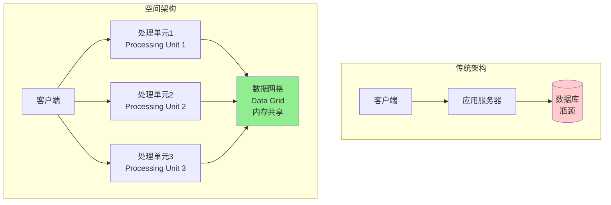
```mermaid
graph TB
    subgraph "传统架构"
        Client[客户端]
        AppServer[应用服务器]
        Database[(数据库<br/>瓶颈)]
        
        Client --> AppServer
        AppServer --> Database
    end
    
    subgraph "空间架构"
        Client2[客户端]
        ProcessingUnit1[处理单元1<br/>Processing Unit 1]
        ProcessingUnit2[处理单元2<br/>Processing Unit 2]
        ProcessingUnit3[处理单元3<br/>Processing Unit 3]
        DataGrid[数据网格<br/>Data Grid<br/>内存共享]
        
        Client2 --> ProcessingUnit1
        Client2 --> ProcessingUnit2
        Client2 --> ProcessingUnit3
        ProcessingUnit1 --> DataGrid
        ProcessingUnit2 --> DataGrid
        ProcessingUnit3 --> DataGrid
    end
    
    style Database fill:#ffcccb
    style DataGrid fill:#90ee90
```

**核心原则**：
- **内存网格**：使用内存数据网格共享数据
- **去中心化**：无单点故障，无中心数据库
- **水平扩展**：可以水平扩展处理单元
- **高性能**：内存访问，性能极高

### 为什么需要空间架构？

空间架构解决了以下问题：
- **数据库瓶颈**：避免传统数据库成为瓶颈
- **高并发**：支持极高的并发访问
- **高可用性**：无单点故障，高可用性
- **可扩展性**：可以水平扩展，线性扩展性能
- **低延迟**：内存访问，延迟极低

---

## 核心概念

### 核心思想

空间架构的核心思想是**去中心化（Decentralization）**和**内存共享（In-Memory Sharing）**：

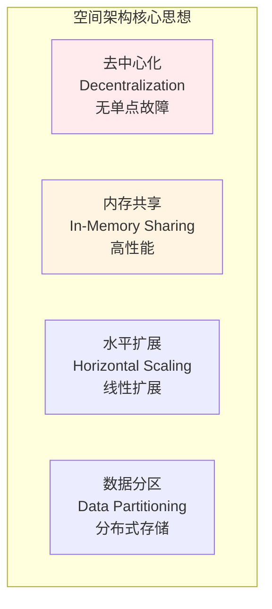
```mermaid
graph TB
    subgraph "空间架构核心思想"
        Decentralization[去中心化<br/>Decentralization<br/>无单点故障]
        InMemory[内存共享<br/>In-Memory Sharing<br/>高性能]
        Horizontal[水平扩展<br/>Horizontal Scaling<br/>线性扩展]
        Partitioning[数据分区<br/>Data Partitioning<br/>分布式存储]
    end
    
    style Decentralization fill:#ffebee
    style InMemory fill:#fff4e1
```

**关键原则**：
1. **去中心化**：无中心数据库，无单点故障
2. **内存共享**：使用内存数据网格共享数据
3. **水平扩展**：可以水平扩展处理单元
4. **数据分区**：数据分区存储，提高性能

### 基本特征

- **内存网格**：使用内存数据网格共享数据
- **去中心化**：无单点故障，无中心数据库
- **水平扩展**：可以水平扩展处理单元
- **高性能**：内存访问，性能极高
- **高可用性**：无单点故障，高可用性

---

## 架构结构

### 空间架构完整结构

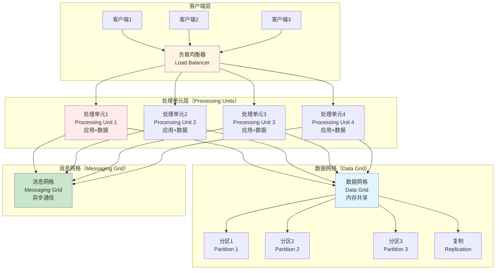
```mermaid
graph TB
    subgraph "客户端层"
        Client1[客户端1]
        Client2[客户端2]
        Client3[客户端3]
        LoadBalancer[负载均衡器<br/>Load Balancer]
    end
    
    subgraph "处理单元层（Processing Units）"
        PU1[处理单元1<br/>Processing Unit 1<br/>应用+数据]
        PU2[处理单元2<br/>Processing Unit 2<br/>应用+数据]
        PU3[处理单元3<br/>Processing Unit 3<br/>应用+数据]
        PU4[处理单元4<br/>Processing Unit 4<br/>应用+数据]
    end
    
    subgraph "数据网格（Data Grid）"
        DataGrid[数据网格<br/>Data Grid<br/>内存共享]
        Partition1[分区1<br/>Partition 1]
        Partition2[分区2<br/>Partition 2]
        Partition3[分区3<br/>Partition 3]
        Replication[复制<br/>Replication]
    end
    
    subgraph "消息网格（Messaging Grid）"
        MessageGrid[消息网格<br/>Messaging Grid<br/>异步通信]
    end
    
    Client1 --> LoadBalancer
    Client2 --> LoadBalancer
    Client3 --> LoadBalancer
    
    LoadBalancer --> PU1
    LoadBalancer --> PU2
    LoadBalancer --> PU3
    LoadBalancer --> PU4
    
    PU1 --> DataGrid
    PU2 --> DataGrid
    PU3 --> DataGrid
    PU4 --> DataGrid
    
    DataGrid --> Partition1
    DataGrid --> Partition2
    DataGrid --> Partition3
    DataGrid --> Replication
    
    PU1 --> MessageGrid
    PU2 --> MessageGrid
    PU3 --> MessageGrid
    PU4 --> MessageGrid
    
    style LoadBalancer fill:#fff4e1
    style PU1 fill:#ffebee
    style DataGrid fill:#e1f5ff
    style MessageGrid fill:#c8e6c9
```

### 核心组件详解

#### 1. 处理单元（Processing Unit）

**定义**：包含应用逻辑和数据的独立单元

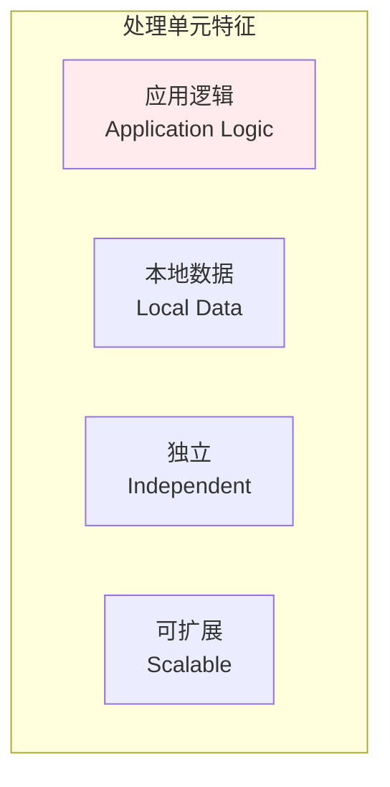
```mermaid
graph TB
    subgraph "处理单元特征"
        Application[应用逻辑<br/>Application Logic]
        LocalData[本地数据<br/>Local Data]
        Independent[独立<br/>Independent]
        Scalable[可扩展<br/>Scalable]
    end
    
    style Application fill:#ffebee
```

**职责**：
- 包含应用逻辑
- 管理本地数据
- 与数据网格交互
- 处理客户端请求

**特点**：
- 独立部署和运行
- 包含应用和数据
- 可以水平扩展
- 无状态或有状态

#### 2. 数据网格（Data Grid）

**定义**：内存中的数据共享网格

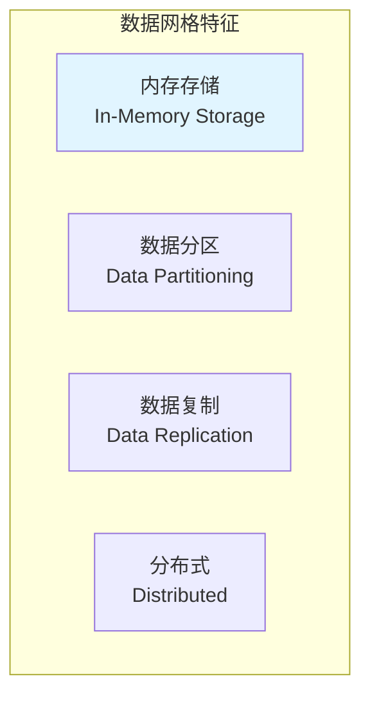
```mermaid
graph TB
    subgraph "数据网格特征"
        InMemory[内存存储<br/>In-Memory Storage]
        Partitioning[数据分区<br/>Data Partitioning]
        Replication[数据复制<br/>Data Replication]
        Distribution[分布式<br/>Distributed]
    end
    
    style InMemory fill:#e1f5ff
```

**职责**：
- 存储共享数据
- 数据分区
- 数据复制
- 数据同步

**特点**：
- 内存存储，性能高
- 数据分区，提高性能
- 数据复制，提高可用性
- 分布式存储

#### 3. 消息网格（Messaging Grid）

**定义**：处理单元之间的异步通信机制

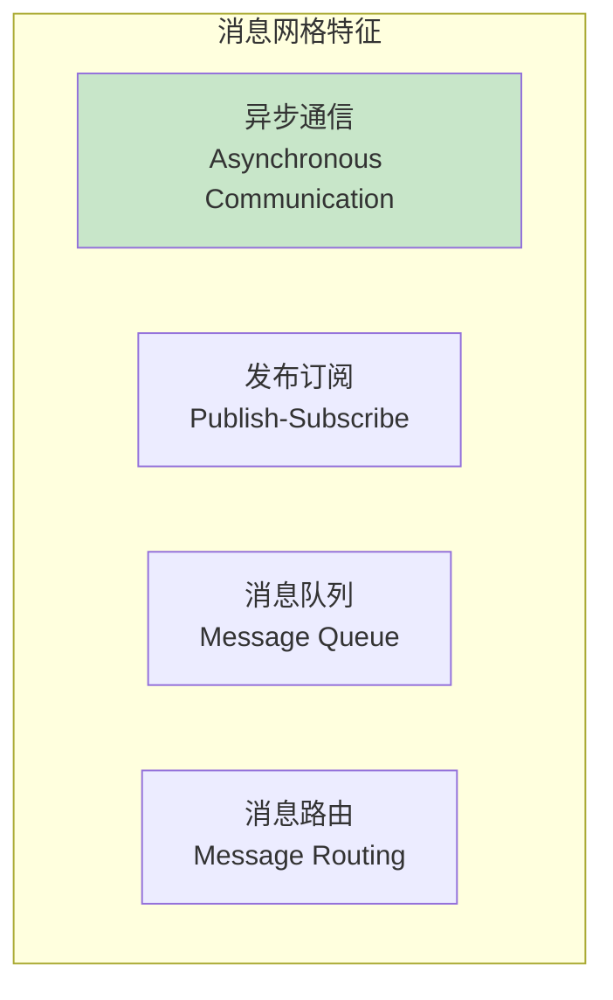
```mermaid
graph TB
    subgraph "消息网格特征"
        Async[异步通信<br/>Asynchronous Communication]
        PubSub[发布订阅<br/>Publish-Subscribe]
        Queue[消息队列<br/>Message Queue]
        Routing[消息路由<br/>Message Routing]
    end
    
    style Async fill:#c8e6c9
```

**职责**：
- 处理单元间通信
- 消息路由
- 消息队列
- 发布订阅

**特点**：
- 异步通信
- 解耦处理单元
- 支持发布订阅
- 支持消息队列

#### 4. 数据分区（Data Partitioning）

**定义**：将数据分区存储在不同处理单元

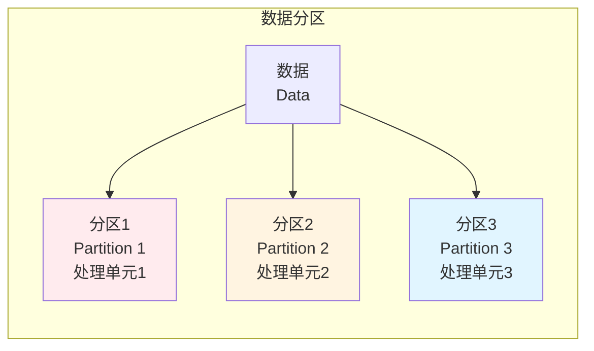
```mermaid
graph LR
    subgraph "数据分区"
        Data[数据<br/>Data]
        Partition1[分区1<br/>Partition 1<br/>处理单元1]
        Partition2[分区2<br/>Partition 2<br/>处理单元2]
        Partition3[分区3<br/>Partition 3<br/>处理单元3]
        
        Data --> Partition1
        Data --> Partition2
        Data --> Partition3
    end
    
    style Partition1 fill:#ffebee
    style Partition2 fill:#fff4e1
    style Partition3 fill:#e1f5ff
```

**策略**：
- **哈希分区**：根据键的哈希值分区
- **范围分区**：根据数据范围分区
- **目录分区**：根据目录规则分区

#### 5. 数据复制（Data Replication）

**定义**：将数据复制到多个处理单元

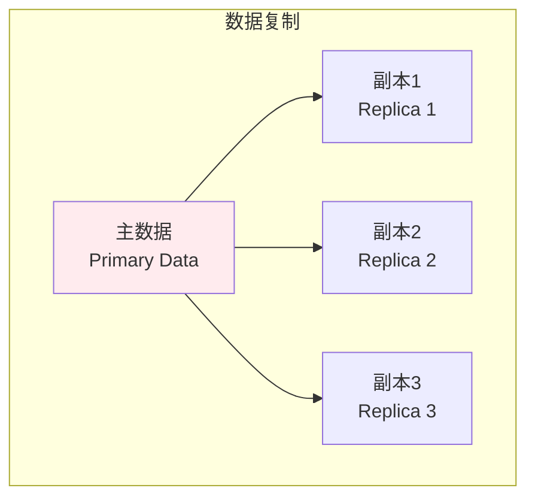
```mermaid
graph TB
    subgraph "数据复制"
        Primary[主数据<br/>Primary Data]
        Replica1[副本1<br/>Replica 1]
        Replica2[副本2<br/>Replica 2]
        Replica3[副本3<br/>Replica 3]
        
        Primary --> Replica1
        Primary --> Replica2
        Primary --> Replica3
    end
    
    style Primary fill:#ffebee
```

**策略**：
- **主从复制**：一个主副本，多个从副本
- **多主复制**：多个主副本
- **同步复制**：实时同步
- **异步复制**：延迟同步

---

## 设计规则

### 空间架构设计规则

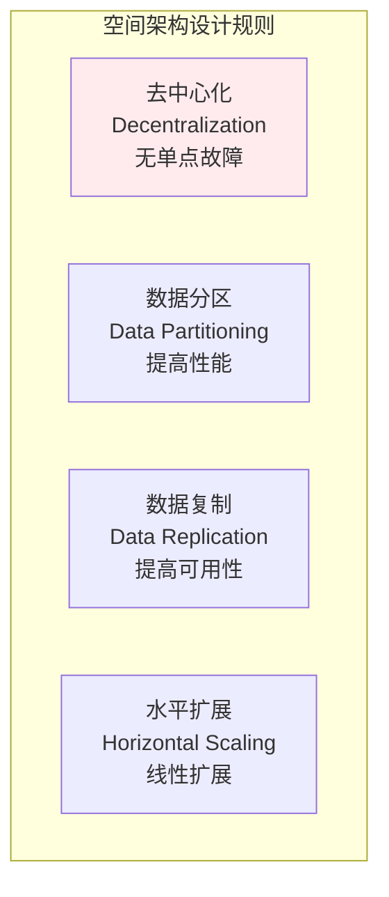
```mermaid
graph TB
    subgraph "空间架构设计规则"
        Rule1[去中心化<br/>Decentralization<br/>无单点故障]
        Rule2[数据分区<br/>Data Partitioning<br/>提高性能]
        Rule3[数据复制<br/>Data Replication<br/>提高可用性]
        Rule4[水平扩展<br/>Horizontal Scaling<br/>线性扩展]
    end
    
    style Rule1 fill:#ffebee
```

**规则说明**：
- ✅ **去中心化**：无中心数据库，无单点故障
- ✅ **数据分区**：数据分区存储，提高性能
- ✅ **数据复制**：数据复制，提高可用性
- ✅ **水平扩展**：可以水平扩展处理单元

### 数据访问规则

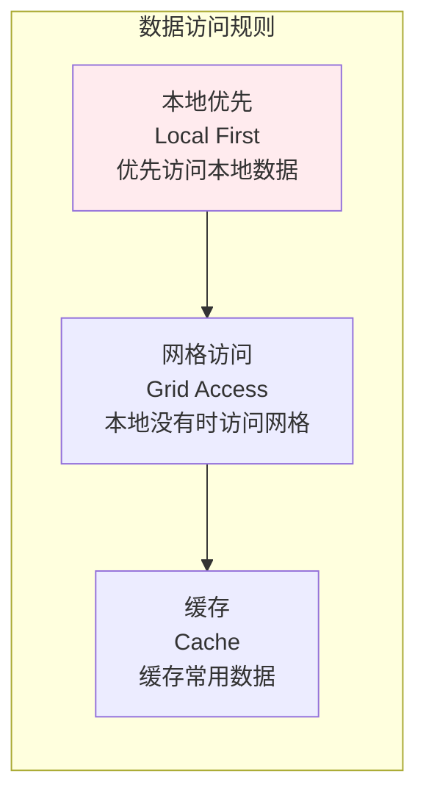
```mermaid
graph LR
    subgraph "数据访问规则"
        LocalFirst[本地优先<br/>Local First<br/>优先访问本地数据]
        GridAccess[网格访问<br/>Grid Access<br/>本地没有时访问网格]
        Cache[缓存<br/>Cache<br/>缓存常用数据]
    end
    
    LocalFirst --> GridAccess
    GridAccess --> Cache
    
    style LocalFirst fill:#ffebee
```

**规则说明**：
- ✅ **本地优先**：优先访问本地数据
- ✅ **网格访问**：本地没有时访问数据网格
- ✅ **缓存**：缓存常用数据，提高性能

---

## 优缺点分析

### 优点

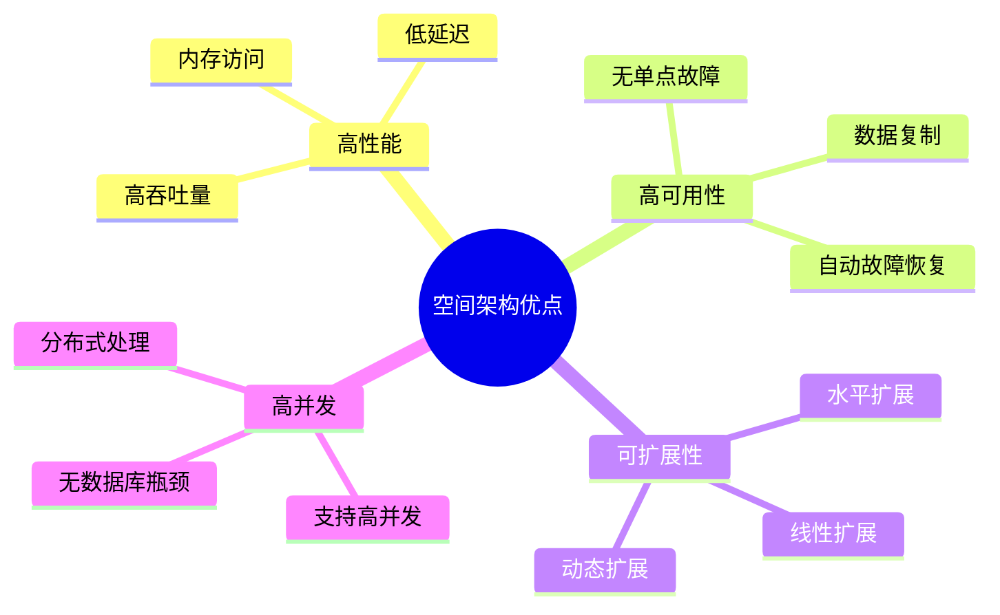
```mermaid
mindmap
  root((空间架构优点))
    高性能
      内存访问
      低延迟
      高吞吐量
    高可用性
      无单点故障
      数据复制
      自动故障恢复
    可扩展性
      水平扩展
      线性扩展
      动态扩展
    高并发
      支持高并发
      无数据库瓶颈
      分布式处理
```

**详细说明**：
- ✅ **高性能**：内存访问，性能极高，延迟极低
- ✅ **高可用性**：无单点故障，数据复制，自动故障恢复
- ✅ **可扩展性**：可以水平扩展，线性扩展性能
- ✅ **高并发**：支持极高的并发访问，无数据库瓶颈

### 缺点

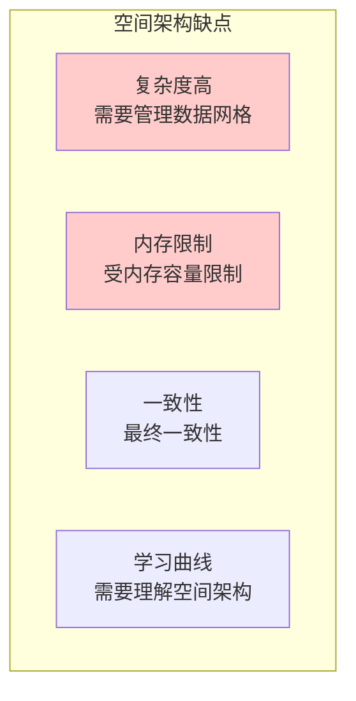
```mermaid
graph TB
    subgraph "空间架构缺点"
        Complexity[复杂度高<br/>需要管理数据网格]
        Memory[内存限制<br/>受内存容量限制]
        Consistency[一致性<br/>最终一致性]
        Learning[学习曲线<br/>需要理解空间架构]
    end
    
    style Complexity fill:#ffcccb
    style Memory fill:#ffcccb
```

**详细说明**：
- ❌ **复杂度高**：需要管理数据网格和消息网格
- ❌ **内存限制**：受内存容量限制，不适合大数据
- ❌ **一致性**：只能保证最终一致性，不是强一致性
- ❌ **学习曲线**：需要理解空间架构概念
- ❌ **成本高**：需要大量内存，成本较高

---

## 实践指南

### 空间架构实施步骤

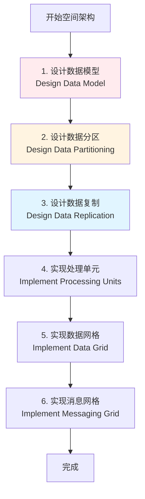
```mermaid
graph TD
    Start[开始空间架构] --> Step1[1. 设计数据模型<br/>Design Data Model]
    Step1 --> Step2[2. 设计数据分区<br/>Design Data Partitioning]
    Step2 --> Step3[3. 设计数据复制<br/>Design Data Replication]
    Step3 --> Step4[4. 实现处理单元<br/>Implement Processing Units]
    Step4 --> Step5[5. 实现数据网格<br/>Implement Data Grid]
    Step5 --> Step6[6. 实现消息网格<br/>Implement Messaging Grid]
    Step6 --> End[完成]
    
    style Step1 fill:#ffebee
    style Step2 fill:#fff4e1
    style Step3 fill:#e1f5ff
```

### 数据分区策略

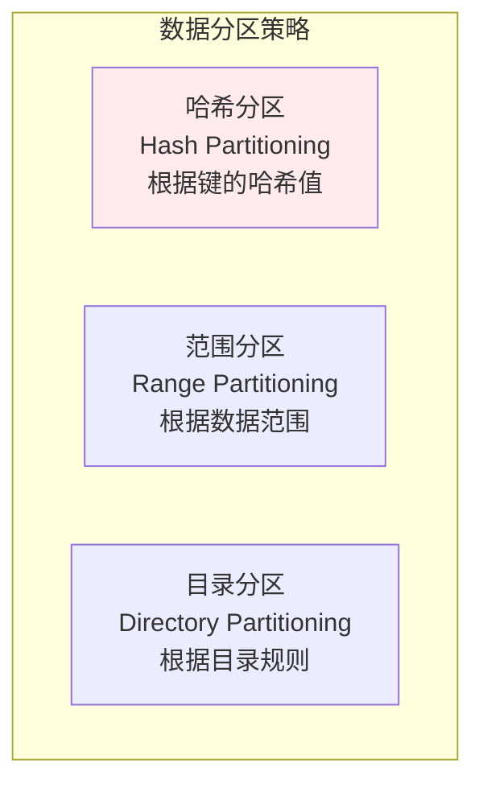
```mermaid
graph TB
    subgraph "数据分区策略"
        Hash[哈希分区<br/>Hash Partitioning<br/>根据键的哈希值]
        Range[范围分区<br/>Range Partitioning<br/>根据数据范围]
        Directory[目录分区<br/>Directory Partitioning<br/>根据目录规则]
    end
    
    style Hash fill:#ffebee
```

**分区策略**：
- ✅ **哈希分区**：根据键的哈希值分区，分布均匀
- ✅ **范围分区**：根据数据范围分区，适合范围查询
- ✅ **目录分区**：根据目录规则分区，灵活可控

---

## 与其他架构模式的关系

### 空间架构与其他架构的关系

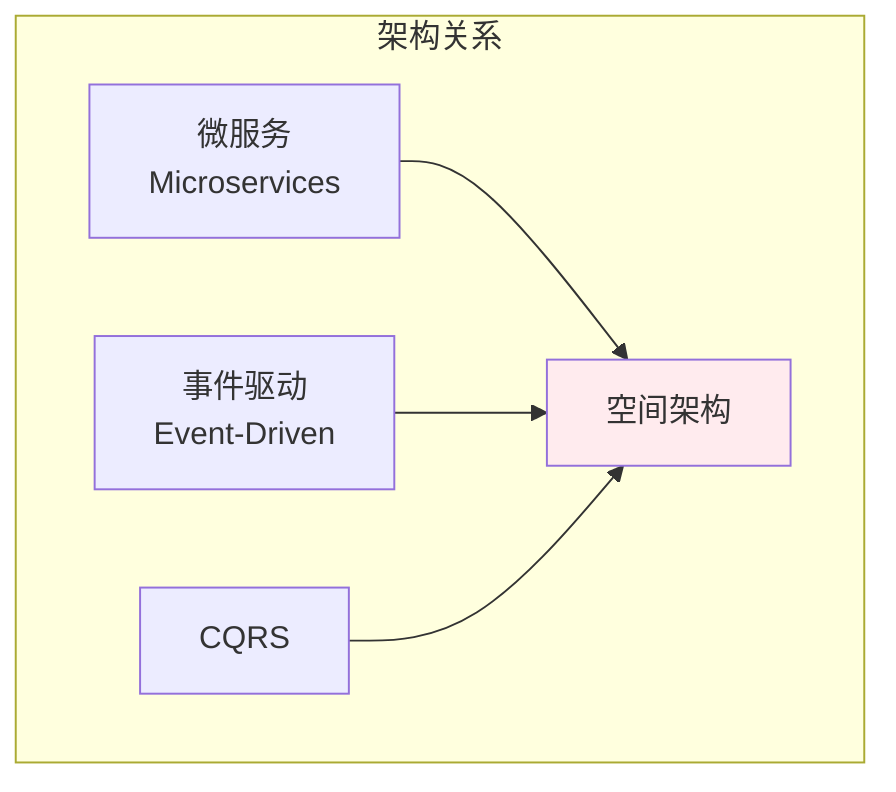
```mermaid
graph TB
    subgraph "架构关系"
        Space[空间架构]
        Microservices[微服务<br/>Microservices]
        EventDriven[事件驱动<br/>Event-Driven]
        CQRS[CQRS]
        
        Microservices --> Space
        EventDriven --> Space
        CQRS --> Space
    end
    
    style Space fill:#ffebee
```

**关系说明**：
- **微服务**：空间架构可以用于微服务架构
- **事件驱动**：空间架构常与事件驱动结合
- **CQRS**：空间架构可以与CQRS结合使用

---

## 应用场景

### 适用场景

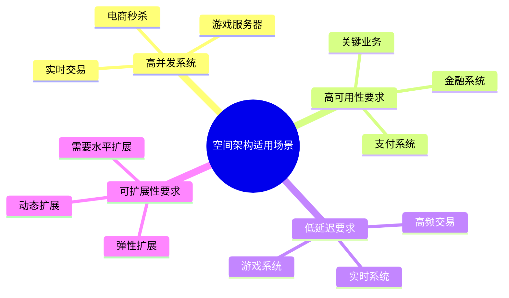
```mermaid
mindmap
  root((空间架构适用场景))
    高并发系统
      电商秒杀
      游戏服务器
      实时交易
    高可用性要求
      金融系统
      支付系统
      关键业务
    低延迟要求
      实时系统
      高频交易
      游戏系统
    可扩展性要求
      需要水平扩展
      动态扩展
      弹性扩展
```

**具体场景**：
- ✅ **电商秒杀**：高并发、低延迟
- ✅ **游戏服务器**：高并发、低延迟
- ✅ **实时交易**：低延迟、高可用
- ✅ **金融系统**：高可用、高性能

### 不适用场景

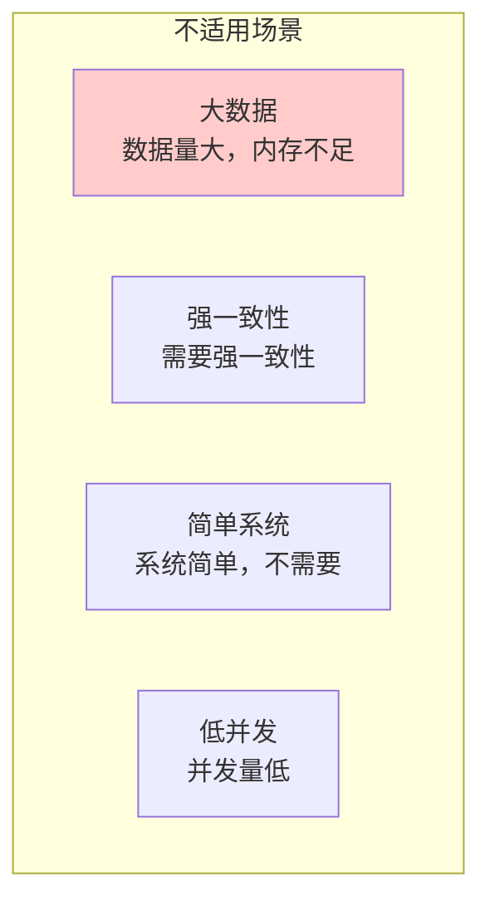
```mermaid
graph TB
    subgraph "不适用场景"
        BigData[大数据<br/>数据量大，内存不足]
        StrongConsistency[强一致性<br/>需要强一致性]
        Simple[简单系统<br/>系统简单，不需要]
        LowConcurrency[低并发<br/>并发量低]
    end
    
    style BigData fill:#ffcccb
```

**不适用场景**：
- ❌ **大数据**：数据量大，内存不足
- ❌ **强一致性**：需要强一致性的场景
- ❌ **简单系统**：系统简单，不需要空间架构
- ❌ **低并发**：并发量低，不需要空间架构

---

## 实际案例

### 案例1：电商秒杀系统

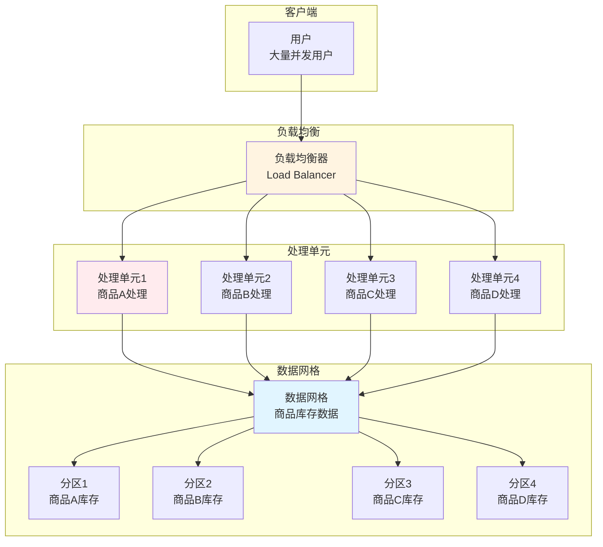
```mermaid
graph TB
    subgraph "客户端"
        Users[用户<br/>大量并发用户]
    end
    
    subgraph "负载均衡"
        LB[负载均衡器<br/>Load Balancer]
    end
    
    subgraph "处理单元"
        PU1[处理单元1<br/>商品A处理]
        PU2[处理单元2<br/>商品B处理]
        PU3[处理单元3<br/>商品C处理]
        PU4[处理单元4<br/>商品D处理]
    end
    
    subgraph "数据网格"
        DataGrid[数据网格<br/>商品库存数据]
        Partition1[分区1<br/>商品A库存]
        Partition2[分区2<br/>商品B库存]
        Partition3[分区3<br/>商品C库存]
        Partition4[分区4<br/>商品D库存]
    end
    
    Users --> LB
    LB --> PU1
    LB --> PU2
    LB --> PU3
    LB --> PU4
    
    PU1 --> DataGrid
    PU2 --> DataGrid
    PU3 --> DataGrid
    PU4 --> DataGrid
    
    DataGrid --> Partition1
    DataGrid --> Partition2
    DataGrid --> Partition3
    DataGrid --> Partition4
    
    style LB fill:#fff4e1
    style PU1 fill:#ffebee
    style DataGrid fill:#e1f5ff
```

### 案例2：游戏战斗服务器

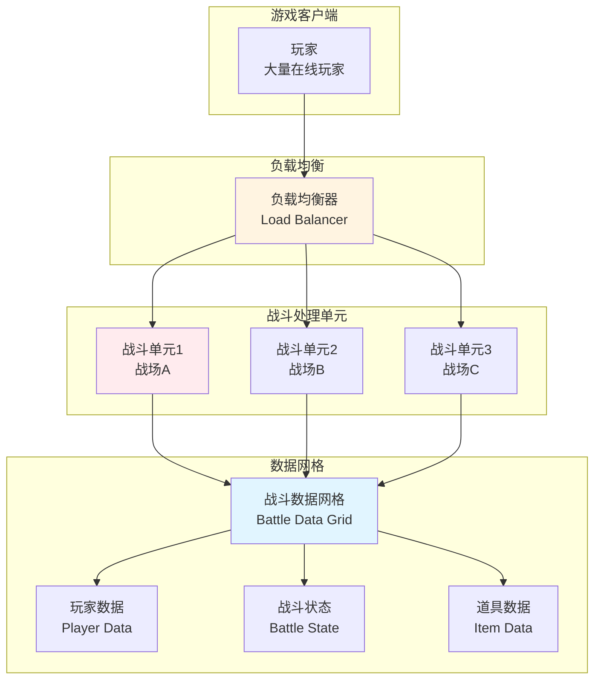
```mermaid
graph TB
    subgraph "游戏客户端"
        Players[玩家<br/>大量在线玩家]
    end
    
    subgraph "负载均衡"
        LB[负载均衡器<br/>Load Balancer]
    end
    
    subgraph "战斗处理单元"
        BattlePU1[战斗单元1<br/>战场A]
        BattlePU2[战斗单元2<br/>战场B]
        BattlePU3[战斗单元3<br/>战场C]
    end
    
    subgraph "数据网格"
        BattleDataGrid[战斗数据网格<br/>Battle Data Grid]
        PlayerData[玩家数据<br/>Player Data]
        BattleState[战斗状态<br/>Battle State]
        ItemData[道具数据<br/>Item Data]
    end
    
    Players --> LB
    LB --> BattlePU1
    LB --> BattlePU2
    LB --> BattlePU3
    
    BattlePU1 --> BattleDataGrid
    BattlePU2 --> BattleDataGrid
    BattlePU3 --> BattleDataGrid
    
    BattleDataGrid --> PlayerData
    BattleDataGrid --> BattleState
    BattleDataGrid --> ItemData
    
    style LB fill:#fff4e1
    style BattlePU1 fill:#ffebee
    style BattleDataGrid fill:#e1f5ff
```

---

## 设计原则

### 空间架构设计原则

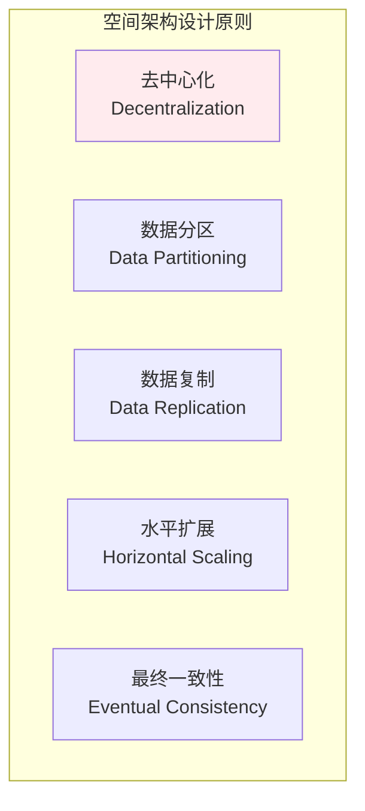
```mermaid
graph TB
    subgraph "空间架构设计原则"
        Principle1[去中心化<br/>Decentralization]
        Principle2[数据分区<br/>Data Partitioning]
        Principle3[数据复制<br/>Data Replication]
        Principle4[水平扩展<br/>Horizontal Scaling]
        Principle5[最终一致性<br/>Eventual Consistency]
    end
    
    style Principle1 fill:#ffebee
```

**核心原则**：
- **去中心化**：无单点故障，无中心数据库
- **数据分区**：数据分区存储，提高性能
- **数据复制**：数据复制，提高可用性
- **水平扩展**：可以水平扩展处理单元
- **最终一致性**：保证最终一致性

---

## 总结

空间架构模式通过内存数据网格实现去中心化的数据共享和处理，是构建高并发、高可用系统的优秀架构模式。

**核心价值**：
- 🚀 **高性能**：内存访问，性能极高，延迟极低
- 🛡️ **高可用性**：无单点故障，数据复制，自动故障恢复
- 📈 **可扩展性**：可以水平扩展，线性扩展性能
- ⚡ **高并发**：支持极高的并发访问，无数据库瓶颈

**适用场景**：
- ✅ 高并发系统
- ✅ 高可用性要求
- ✅ 低延迟要求
- ✅ 可扩展性要求

**注意事项**：
- ⚠️ 复杂度较高，需要管理数据网格
- ⚠️ 受内存容量限制，不适合大数据
- ⚠️ 只能保证最终一致性
- ⚠️ 需要大量内存，成本较高

空间架构是构建高并发、高可用系统的优秀架构模式，特别适合需要极高性能和可用性的系统。

