# 领域驱动设计架构模式（Domain-Driven Design Architecture Pattern）

## 目录

- [概述](#概述)
- [核心概念](#核心概念)
- [架构结构](#架构结构)
- [设计规则](#设计规则)
- [优缺点分析](#优缺点分析)
- [实践指南](#实践指南)
- [与其他架构模式的关系](#与其他架构模式的关系)
- [应用场景](#应用场景)
- [实际案例](#实际案例)
- [设计原则](#设计原则)
- [总结](#总结)

---

## 概述

**领域驱动设计架构模式（Domain-Driven Design Architecture Pattern，DDD）**是由Eric Evans提出的一种软件设计方法论，它强调以业务领域为核心，通过领域模型来表达业务逻辑，使用通用语言（Ubiquitous Language）来沟通业务和技术。

### 什么是领域驱动设计？

领域驱动设计是一种以领域模型为中心的架构方法：

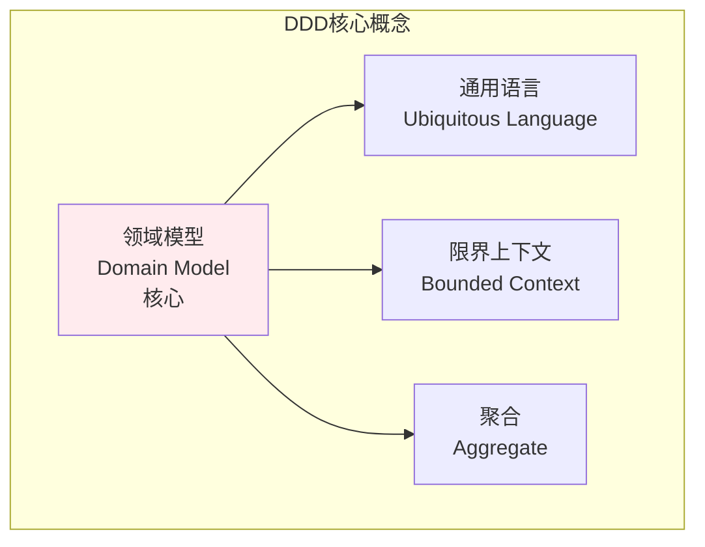

**核心原则**：
- **领域模型在中心**：业务逻辑通过领域模型表达
- **通用语言**：业务和技术使用相同的语言
- **限界上下文**：明确业务边界和上下文
- **聚合根**：保证数据一致性

### 为什么需要领域驱动设计？

领域驱动设计解决了以下问题：
- **业务复杂性**：通过领域模型表达复杂业务逻辑
- **沟通障碍**：使用通用语言消除业务和技术之间的沟通障碍
- **代码质量**：领域模型使代码更贴近业务，易于理解
- **可维护性**：清晰的领域边界，易于维护和扩展
- **业务价值**：代码直接反映业务价值，而非技术实现

---

## 核心概念

### 核心思想

领域驱动设计的核心思想是**以领域为中心（Domain-Centric）**：

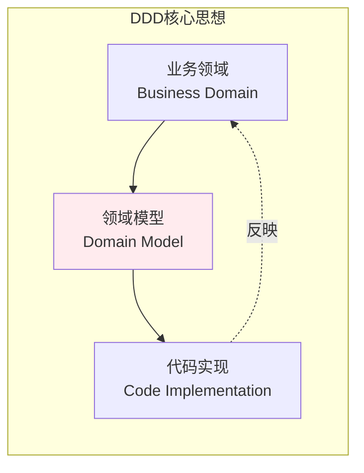

**关键原则**：
1. **领域模型在中心**：业务逻辑通过领域模型表达
2. **通用语言**：业务和技术使用相同的语言
3. **限界上下文**：明确业务边界
4. **聚合根**：保证数据一致性

### 基本特征

- **领域模型**：通过模型表达业务逻辑
- **通用语言**：业务和技术使用相同的语言
- **限界上下文**：明确业务边界
- **聚合根**：保证数据一致性
- **领域服务**：跨实体的业务逻辑

---

## 架构结构

### DDD完整架构结构

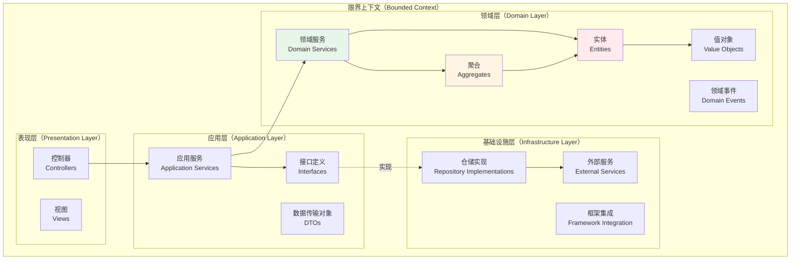

### 核心组件详解

#### 1. 实体（Entity）

**定义**：有唯一标识的对象

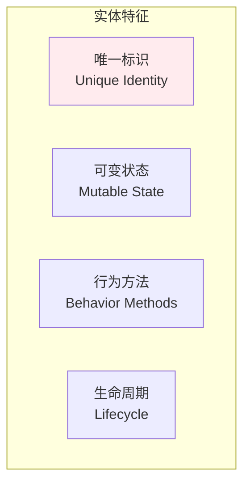

**特点**：
- 有唯一标识（ID）
- 状态可以改变
- 包含业务行为
- 有生命周期

**示例**：
- 订单（Order）：有订单ID，状态可以改变
- 用户（User）：有用户ID，信息可以更新
- 产品（Product）：有产品ID，库存可以变化

#### 2. 值对象（Value Object）

**定义**：通过值相等判断的对象

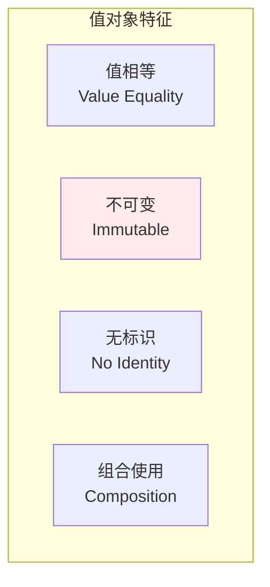

**特点**：
- 通过值相等判断
- 不可变（Immutable）
- 无唯一标识
- 通常作为实体的属性

**示例**：
- 金额（Money）：通过数值相等判断
- 地址（Address）：通过地址内容相等判断
- 日期（Date）：通过日期值相等判断

#### 3. 聚合（Aggregate）

**定义**：一组相关对象的集合，由聚合根管理

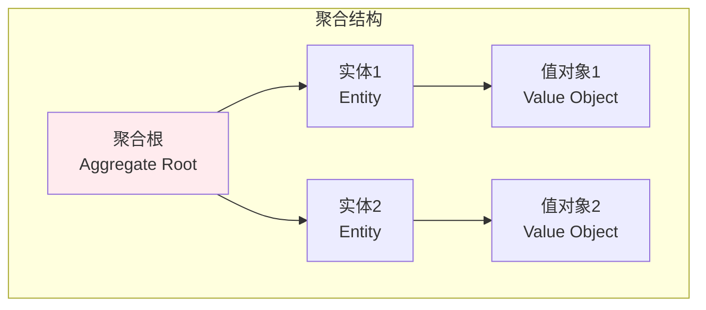

**特点**：
- 有聚合根（Aggregate Root）
- 聚合根是唯一的外部访问点
- 保证数据一致性（不变量）
- 有明确的边界

**示例**：
- 订单聚合：订单（聚合根）+ 订单项（实体）+ 地址（值对象）
- 用户聚合：用户（聚合根）+ 地址列表（实体）+ 联系方式（值对象）

#### 4. 聚合根（Aggregate Root）

**定义**：聚合的入口点，外部只能通过聚合根访问聚合

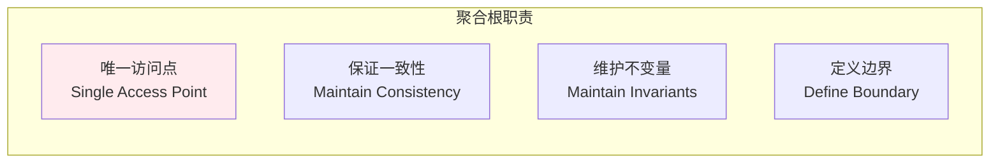

**职责**：
- 是聚合的唯一外部访问点
- 保证聚合内数据一致性
- 维护业务不变量
- 定义聚合边界

#### 5. 领域服务（Domain Service）

**定义**：跨实体的业务逻辑

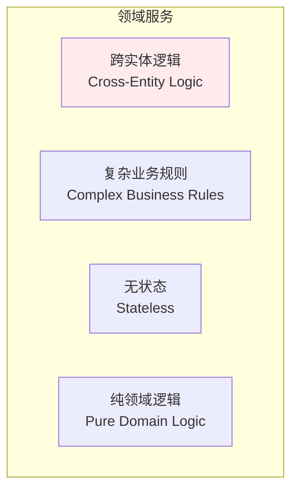

**特点**：
- 包含跨实体的业务逻辑
- 实现复杂的业务规则
- 无状态服务
- 纯领域逻辑，不依赖基础设施

**示例**：
- 定价服务：计算订单总价（涉及订单、产品、折扣）
- 转账服务：处理账户转账（涉及两个账户）

#### 6. 领域事件（Domain Event）

**定义**：领域中发生的重要事情

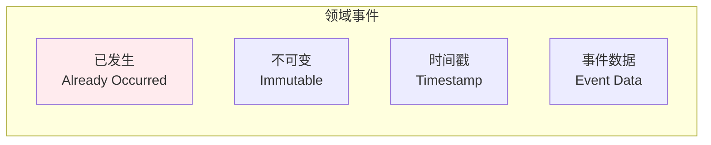

**特点**：
- 表示已经发生的事情
- 不可变
- 有时间戳
- 包含事件数据

**示例**：
- 订单已创建（OrderCreated）
- 支付已完成（PaymentCompleted）
- 库存已更新（InventoryUpdated）

#### 7. 仓储（Repository）

**定义**：封装数据访问逻辑

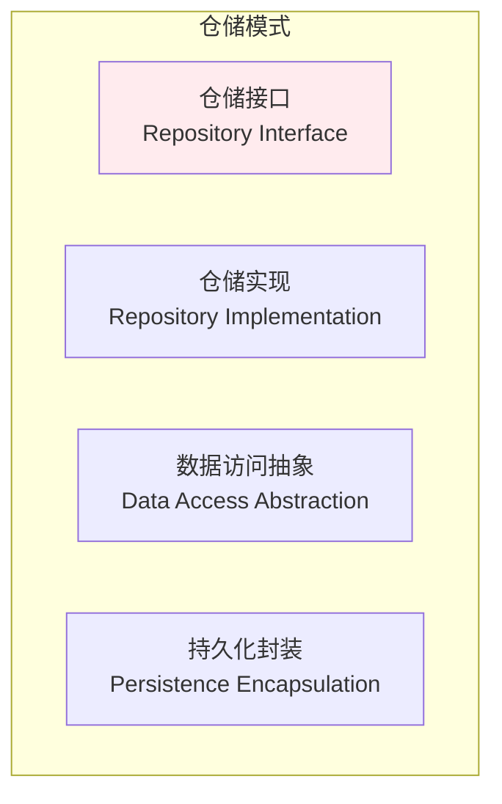

**职责**：
- 封装数据访问逻辑
- 提供聚合的持久化接口
- 抽象数据存储细节
- 实现数据访问抽象

#### 8. 限界上下文（Bounded Context）

**定义**：明确的业务边界

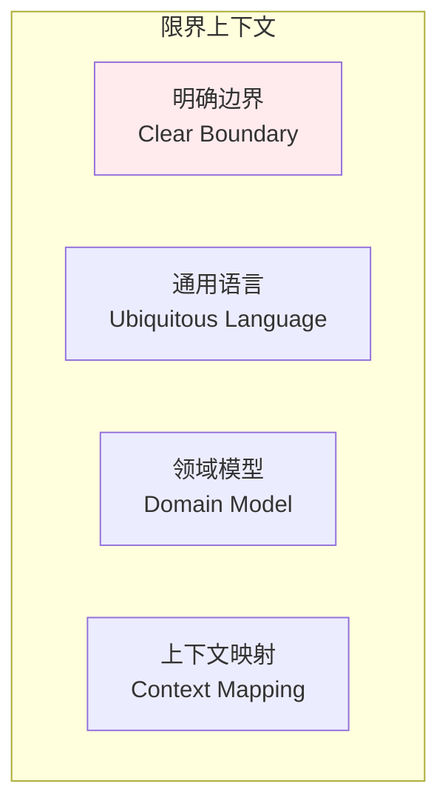

**特点**：
- 有明确的业务边界
- 使用通用语言
- 包含完整的领域模型
- 与其他上下文有映射关系

---

## 设计规则

### 聚合设计规则

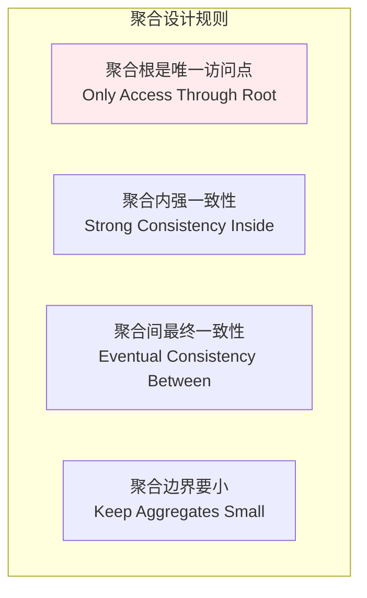

**规则说明**：
- ✅ **唯一访问点**：外部只能通过聚合根访问聚合
- ✅ **强一致性**：聚合内数据必须一致
- ✅ **最终一致性**：聚合间可以最终一致
- ✅ **边界要小**：聚合应该尽可能小

### 实体和值对象选择规则

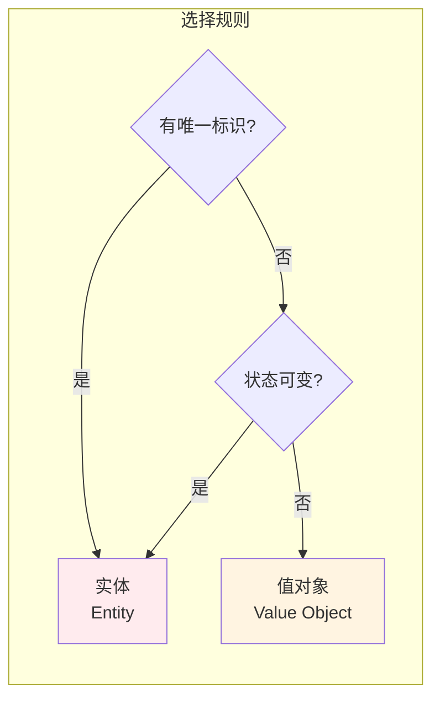

**选择标准**：
- **实体**：有唯一标识，或状态需要改变
- **值对象**：无唯一标识，且不可变

---

## 优缺点分析

### 优点

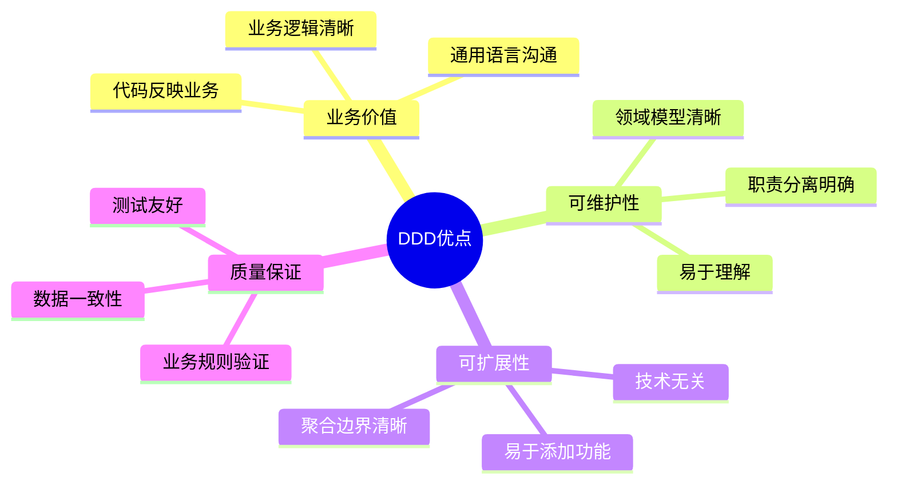

**详细说明**：
- ✅ **业务价值**：代码直接反映业务，易于理解
- ✅ **通用语言**：消除业务和技术之间的沟通障碍
- ✅ **可维护性**：领域模型清晰，易于维护
- ✅ **可扩展性**：聚合边界清晰，易于扩展
- ✅ **质量保证**：通过聚合保证数据一致性

### 缺点

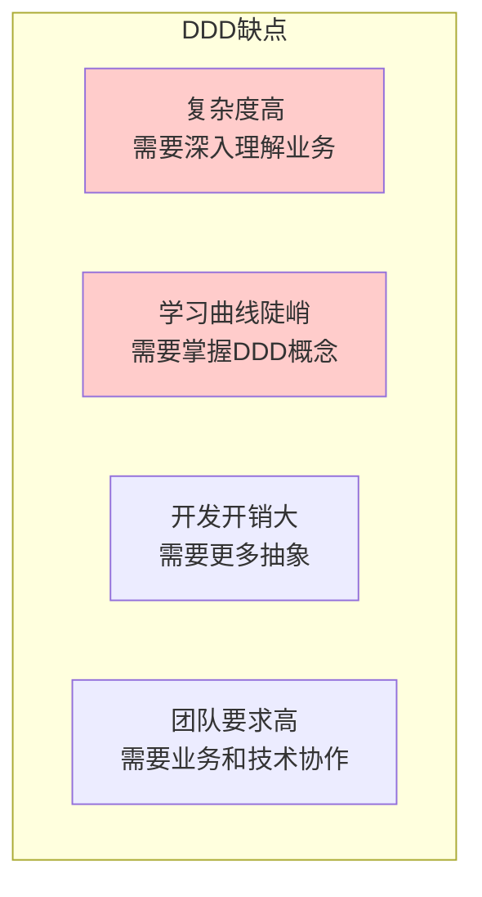

**详细说明**：
- ❌ **复杂度高**：需要深入理解业务领域
- ❌ **学习曲线陡峭**：需要掌握DDD概念和方法
- ❌ **开发开销大**：需要更多抽象和设计
- ❌ **团队要求高**：需要业务和技术密切协作
- ❌ **可能过度设计**：简单项目可能不需要DDD

---

## 实践指南

### DDD实施步骤

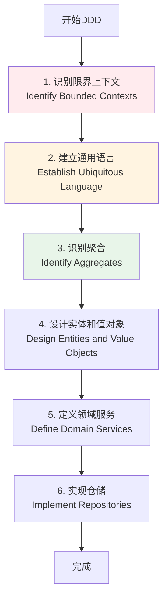

### 领域建模流程

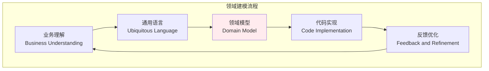

**实施建议**：
1. **业务优先**：深入理解业务领域
2. **通用语言**：建立业务和技术之间的通用语言
3. **迭代建模**：通过迭代不断完善领域模型
4. **代码验证**：通过代码实现验证模型

---

## 与其他架构模式的关系

### DDD与其他架构的关系

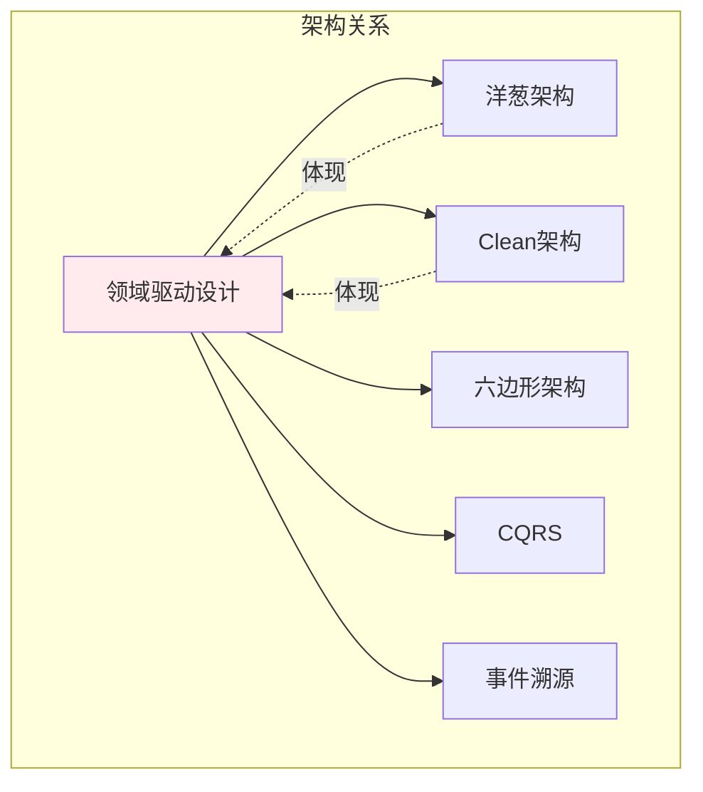

**关系说明**：
- **洋葱架构**：DDD的架构实现方式之一
- **Clean架构**：DDD的架构实现方式之一
- **六边形架构**：DDD的架构实现方式之一
- **CQRS**：常与DDD结合使用
- **事件溯源**：常与DDD结合使用

---

## 应用场景

### 适用场景

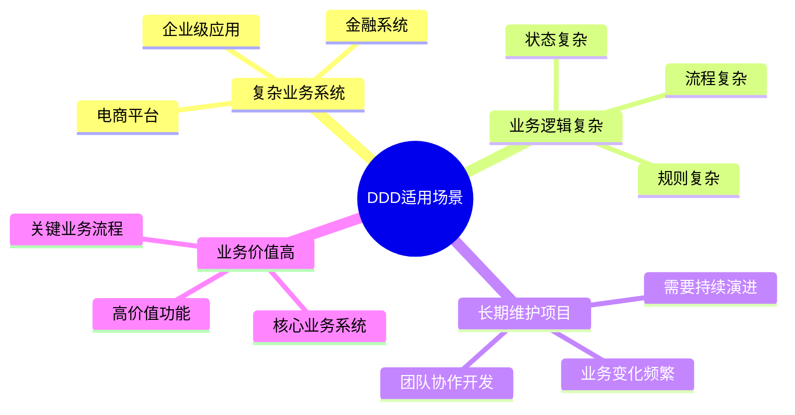

**具体场景**：
- ✅ **复杂业务系统**：业务逻辑复杂，需要领域模型
- ✅ **企业级应用**：需要长期维护和演进
- ✅ **金融系统**：业务规则复杂，需要严格验证
- ✅ **电商平台**：业务逻辑复杂，需要灵活扩展

### 不适用场景

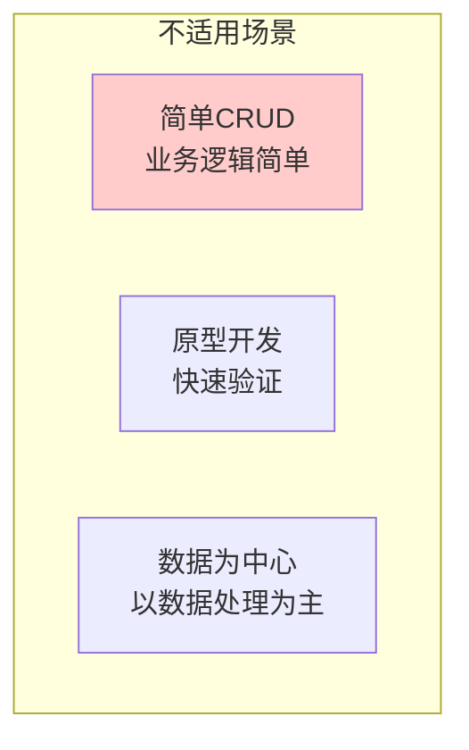

**不适用场景**：
- ❌ **简单CRUD**：业务逻辑简单，不需要领域模型
- ❌ **原型开发**：快速验证，不需要完整DDD
- ❌ **数据为中心**：以数据处理为主，业务逻辑简单

---

## 实际案例

### 案例1：电商订单系统

```mermaid
graph TB
    subgraph "订单聚合"
        OrderRoot[订单聚合根<br/>Order Aggregate Root]
        OrderItem1[订单项1<br/>OrderItem Entity]
        OrderItem2[订单项2<br/>OrderItem Entity]
        ShippingAddress[配送地址<br/>Address ValueObject]
        Money[金额<br/>Money ValueObject]
    end
    
    subgraph "领域服务"
        PricingService[定价服务<br/>PricingDomainService]
        ValidationService[验证服务<br/>ValidationDomainService]
    end
    
    subgraph "领域事件"
        OrderCreated[订单已创建<br/>OrderCreated Event]
        OrderPaid[订单已支付<br/>OrderPaid Event]
    end
    
    OrderRoot --> OrderItem1
    OrderRoot --> OrderItem2
    OrderItem1 --> Money
    OrderRoot --> ShippingAddress
    
    PricingService --> OrderRoot
    ValidationService --> OrderRoot
    
    OrderRoot -.触发.-> OrderCreated
    OrderRoot -.触发.-> OrderPaid
    
    style OrderRoot fill:#ffebee
    style PricingService fill:#fff4e1
```

### 案例2：游戏战斗系统

```mermaid
graph TB
    subgraph "战斗聚合"
        BattleRoot[战斗聚合根<br/>Battle Aggregate Root]
        Round[回合实体<br/>Round Entity]
        Team[阵营实体<br/>Team Entity]
        Unit[单位实体<br/>Unit Entity]
        Position[位置值对象<br/>Position ValueObject]
    end
    
    subgraph "领域服务"
        DamageService[伤害计算服务<br/>DamageDomainService]
        TargetService[目标选择服务<br/>TargetDomainService]
    end
    
    subgraph "领域事件"
        UnitActionExecuted[单位行动已执行<br/>UnitActionExecuted Event]
        RoundStarted[回合已开始<br/>RoundStarted Event]
    end
    
    BattleRoot --> Round
    Round --> Team
    Team --> Unit
    Unit --> Position
    
    DamageService --> Unit
    TargetService --> Unit
    
    Unit -.触发.-> UnitActionExecuted
    Round -.触发.-> RoundStarted
    
    style BattleRoot fill:#ffebee
    style DamageService fill:#fff4e1
```

---

## 设计原则

### DDD设计原则

```mermaid
graph TB
    subgraph "DDD设计原则"
        Principle1[领域模型在中心<br/>Domain Model at Center]
        Principle2[通用语言<br/>Ubiquitous Language]
        Principle3[聚合边界<br/>Aggregate Boundaries]
        Principle4[领域事件<br/>Domain Events]
        Principle5[仓储抽象<br/>Repository Abstraction]
    end
    
    style Principle1 fill:#ffebee
```

**核心原则**：
- **领域模型在中心**：业务逻辑通过领域模型表达
- **通用语言**：业务和技术使用相同的语言
- **聚合边界**：通过聚合定义业务边界
- **领域事件**：通过事件实现聚合间通信
- **仓储抽象**：通过仓储抽象数据访问

---

## 总结

领域驱动设计是一种以领域模型为中心的软件设计方法论，通过领域模型表达业务逻辑，使用通用语言沟通业务和技术，通过聚合保证数据一致性。

**核心价值**：
- 🎯 **业务价值**：代码直接反映业务，易于理解
- 💬 **通用语言**：消除业务和技术之间的沟通障碍
- 🏗️ **领域模型**：通过模型表达复杂业务逻辑
- 🔒 **数据一致性**：通过聚合保证数据一致性

**适用场景**：
- ✅ 复杂业务系统
- ✅ 业务逻辑复杂
- ✅ 长期维护项目
- ✅ 业务价值高

**注意事项**：
- ⚠️ 复杂度较高，需要深入理解业务
- ⚠️ 学习曲线陡峭，需要掌握DDD概念
- ⚠️ 团队要求高，需要业务和技术协作

领域驱动设计是构建可维护、可扩展、高质量系统的优秀方法论，特别适合复杂业务系统和长期维护的项目。

