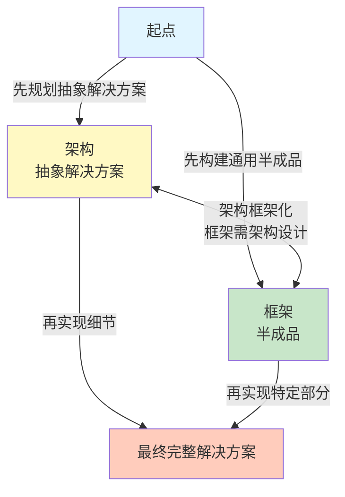
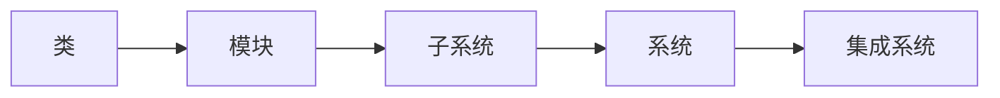
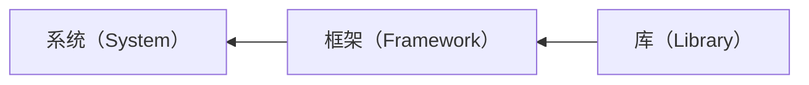
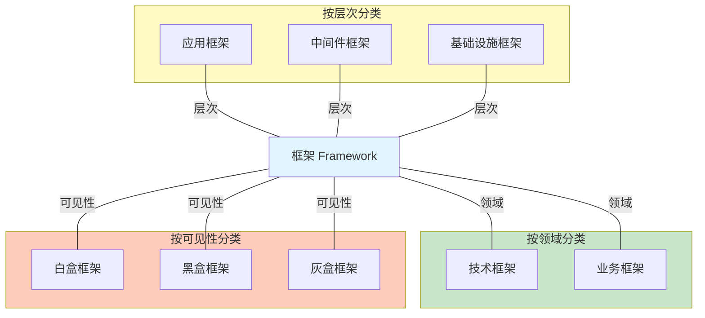
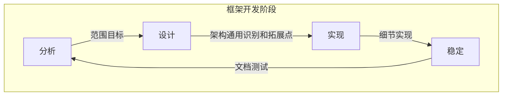
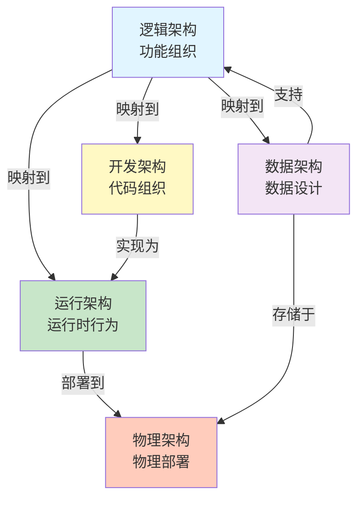

# 软件架构设计

**作者**：温昱  
**出版社**：电子工业出版社  

---
# 软件架构概念及思想篇

## 第一章：软件架构概念解析

###  软件架构的定义

#### 组成派观点
- 架构是由计算组件及其交互组成的系统描述
- 强调架构的**结构组成**和**组件关系**

#### 决策派观点
- 架构是关于系统设计决策的集合
- 强调架构的**设计决策**和**权衡过程**
- 决策派注重其他特性、使用、功能性、性能、弹性、重用、可理解性、经济和技术的限制和权衡以及美学。


### 决策派思路，重点在于决策，而不是组成

```
 系统 -> 嵌入式应用
      └────> 桌面应用 -> 应用层
                └────> 通讯层
```

## 第二章：架构设计方法

###  子系统和框架在架构设计中的地位

> 软件界是新名词制造工厂，需要理清概念之间的关系

**架构设计关注点分离模型：**


**技术谱（Technology Spectrum）：**


###  子系统和框架的关系

#### 核心观点
- **子系统**和**框架**两个概念相辅相成
- 子系统关注**职责划分**和**功能分解**
- 框架关注**通用性**和**可复用性**
- 两者在架构设计中处于不同维度，但相互补充

#### 设计模式的特点
- 无论是架构模式还是设计模式，重点关注的都是：
  - **上下文（Context）**
  - **问题（Problem）**
  - **解决方案（Solution）**
- 例如：抽象工厂（Abstract Factory）设计模式
  - 关注**对象的实例化**
  - 适用于**不同的应用场景**


#### 框架技术
- 框架技术有助于把**通用的关注点**和**专用关注点**分离出来
- 带来更好的**修改性**和**可重用性**
- 框架关注**通用性**和**可复用性**

#### 子系统
- 分层、MVC、管道过滤器等架构模式应该**结合使用**或**子系统层化划分嵌套使用**
- 子系统关注**职责划分**和**功能分解**

###  软件分解场景

#### 分解层次
```
类 → 模块 → 子系统 → 系统 → 集成系统
```

#### 关键概念
- **系统**：多个元素组成的逻辑实体
- **子系统**：特殊的系统，是系统的一部分
- **递归组合**：真实的软件是由组件递归组合而成

###  子系统

#### 子系统的特点
- 系统就是多个元素组成的逻辑实体
- 子系统是特殊的系统，子系统是系统的一部分
- 如果子系统过于复杂也需要架构设计
- 子系统不同，架构设计也不同

#### 子系统的视角（黑盒 vs 白盒）
- **高一级架构设计时**：子系统是一个**黑盒单元**
  - 只关注子系统的接口和职责
  - 不关心内部实现细节
- **子系统一级架构设计时**：子系统是一个**结构复杂的白盒**
  - 需要设计子系统内部的组件和交互
  - 关注子系统内部的架构

> **关键观点**：细节是相对而言的

### 框架

#### 框架的定义
> **框架是一种特殊的软件，架构不是软件**

> **框架是可以通过某种机制（回调机制）进行扩展的软件系统或子系统半成品**

#### 框架的特点
- 框架是**软件**（可执行的代码）
- 架构是**设计决策**（不是软件本身）
- 框架提供**扩展点**（通过回调机制）
- 框架是**半成品**，需要填充具体业务逻辑

###  架构和框架的联系

**架构和框架的开发流程：**



**流程说明：**
1. **起点**：软件开发开始
2. **架构（抽象解决方案）**：先规划抽象解决方案
3. **框架（半成品）**：先构建通用半成品
4. **双向关系**：
   - 架构 → 框架：将系统或子系统架构框架化
   - 框架 → 架构：框架也需架构设计（迭代优化）
5. **最终完整解决方案**：
   - 从架构：再实现细节
   - 从框架：再实现特定部分

#### 关键观点
> **真实的软件是由组件递归组合而成**

- 作为符合整体的软件单元才有架构
- 架构规定了它如何被设计的重要决策
- 在架构设计阶段没有必要关心分解软件单元内部细节
- 架构师对系统的抽象：
  - **公有的**：关注涉及元素之间如何交互
  - **大局**：关注大局，把握细节


---

## 关键概念总结

### 架构 vs 框架

| 维度 | 架构 | 框架 |
|------|------|------|
| **本质** | 设计决策的集合 | 特殊的软件 |
| **形式** | 不是软件 | 可执行的代码 |
| **关注点** | 如何设计系统 | 如何实现系统 |
| **扩展性** | 通过架构模式 | 通过回调机制 |
| **关系** | 架构可以指导框架设计 | 框架可以体现架构思想 |

### 子系统 vs 框架

| 维度 | 子系统 | 框架 |
|------|--------|------|
| **关注点** | 职责划分、功能分解 | 通用性、可复用性 |
| **视角** | 黑盒（高一级）或白盒（本级） | 半成品，需要填充 |
| **使用方式** | 直接调用 | 通过扩展点扩展 |
| **关系** | 相辅相成，不同维度 | 可以结合使用 |

### 软件分解颗粒



### 架构设计的核心原则

1. **关注点分离**：层次、粒度、通用性三个维度
2. **黑盒抽象**：高一级设计时，子系统是黑盒
3. **递归组合**：软件由组件递归组合而成
4. **大局把握**：关注元素间交互，把握大局和细节

### 框架分类

> 框架的粒度是介于系统和库之间的，是可复用的软件单元。

#### 框架的粒度层次


#### 框架的特点
- **粒度**：介于系统和库之间
- **可复用性**：可复用的软件单元
- **半成品**：需要填充具体业务逻辑
- **扩展性**：通过回调机制进行扩展

#### 框架的分类


#### 框架开发阶段



## 软件架构

### 软件架构的位置
- **上承业务目标**，为完成业务目标而进行大局规划
- **下接技术决策**，将面向业务需求转化为面向技术的架构设计方案
- **控制复杂性**，好的架构设计可以控制复杂性，使系统易于维护和扩展
- **组织开发**，架构设计决策可以把不同模块分配给不同小组并行开发，提升开发效率，扮演开发宪法角色。
- **迭代及增量交付**，架构有利于增量交付提供良好的基础
- **提高质量**，规划模块职能，清晰的接口

### 软件产品架构
- 为一系列相关产品而设计的通用架构。由于业务具有部分共同性，且明确许可的变化，所以需要使用产品架构提取公共部分，分离可变部分，提高架构可复用性。

产品架构通过以下方式提高可复用性
- **提取公共部分**：识别并抽象产品间的共性，形成核心架构
- **分离可变部分**：识别产品间的差异点，通过配置、参数化等方式实现可变性
- **建立可变点机制**：支持通过配置、插件、模板等方式快速定制产品

#### 软件架构重构

**定义：**
- 软件架构会磨损，当软件架构变得混乱时，软件架构就需要**再工程**
- 需要经过**逆向工程**、**重新规划**、**正向工程**三个阶段
- **合理的保留，不妥的修正**

**重构的三个阶段：**

1. **逆向工程（Reverse Engineering）**
   - 理解现有架构
   - 分析架构的现状和问题
   - 识别架构的合理部分和不合理部分

2. **重新规划（Re-planning）**
   - 基于理解重新设计架构
   - 保留合理的部分
   - 修正不妥的部分

3. **正向工程（Forward Engineering）**
   - 按照新架构实现
   - 逐步迁移和重构
   - 验证新架构的有效性

**学习心得：**
> 之前看不懂代码重构，但是看了软件架构设计一部分后，才能大致了解重构的核心思路。

**为什么架构设计能帮助理解重构？**

1. **提供全局视角**
   - 架构设计提供了系统的全局视图
   - 重构需要理解系统的整体结构
   - 从架构层面理解，才能知道重构的方向

2. **理解设计原则**
   - 架构设计阐述了设计原则（关注点分离、分层架构等）
   - 重构的目标是让代码符合这些原则
   - 理解了原则，才能理解重构的目标

3. **识别问题本质**
   - 架构设计帮助识别架构层面的问题
   - 代码重构的问题往往是架构问题的体现
   - 从架构层面理解，才能识别问题的本质

4. **明确重构方向**
   - 架构设计提供了"应该是什么样"的蓝图
   - 重构是让代码向这个蓝图靠拢
   - 理解了架构，才能明确重构的方向

**重构的核心思路：**
- 重构不是简单的代码修改
- 重构是让代码**符合架构设计原则**的过程
- 重构需要**从架构层面理解**，而不是从代码细节理解
- 重构的目标是**改善架构质量**，而不仅仅是代码质量

# 软件架构设计方法及过程
  方法 --> 过程-->步骤

## 第四章：软件架构视图

### 架构视图的核心价值

- **多视角审视**：应当从不同角色（业务人员、开发人员、测试人员、运维人员等）的视角来观察和评估软件架构设计的合理性
- **文档化归档**：通过架构视图的文档化归档，确保所有参与人员都能理解架构设计，这是架构设计成功的重要手段
- **利益相关者覆盖**：好的架构设计应该考虑所有软件参与人员的需求和关注点，架构视图是沟通这些需求的重要工具
  
#### 实践指南：逻辑架构与物理架构

**逻辑架构与物理架构是软件架构的两种不同视角：**
- **逻辑架构**：关注软件的逻辑结构，是软件架构的抽象和蓝图
- **物理架构**：关注软件的物理实现，是软件架构的部署和运行视图

##### 逻辑架构（Logical Architecture）

**定义：**
- 逻辑架构关注软件的逻辑结构，包括：
  - 软件的模块划分
  - 组件设计
  - 接口定义
  - 依赖关系
  - 数据流和控制流

**特点：**
- 逻辑架构是软件架构的**抽象**，不关心具体实现
- 逻辑架构是软件架构的**蓝图**，指导详细设计
- 逻辑架构关注"做什么"和"如何组织"

**示例：**
```
逻辑架构层次：
├── 表现层（Presentation Layer）
├── 业务层（Business Layer）
└── 数据层（Data Layer）
```

##### 物理架构（Physical Architecture）

**定义：**
- 物理架构关注软件的物理实现和部署，包括：
  - **运行时结构**：进程、线程、类的运行时实例
  - **动态行为**：进程调度、线程同步、线程通信
  - **部署结构**：硬件配置、操作系统、网络拓扑
  - **可靠性设计**：如何通过机器和网络配置保证系统可靠性
  - **可伸缩性设计**：如何通过部署架构支持系统扩展

**特点：**
- 物理架构关注"在哪里运行"和"如何部署"
- 物理架构需要考虑硬件、网络、操作系统等物理资源
- 物理架构影响系统的性能、可靠性和可伸缩性

**示例：**
```
物理架构部署：
├── 硬件层：服务器、网络设备
├── 操作系统层：Windows/Linux
├── 运行时层：Unity Player、Lua Runtime
└── 应用层：游戏逻辑、配置数据
```

##### 开发架构（Development Architecture）

**定义：**
- 开发架构关注系统的实现和组织结构，包括：
  - **代码组织**：模块、包、类库的组织方式
  - **开发环境**：开发工具、构建系统、版本控制
  - **模块依赖**：模块之间的依赖关系和接口设计
  - **代码结构**：源代码的目录结构、命名规范
  - **开发规范**：编码规范、测试规范、文档规范

**特点：**
- 开发架构关注"如何组织代码"和"如何开发"
- 开发架构需要考虑开发团队的组织结构
- 开发架构影响系统的可维护性和可扩展性

**示例：**
```
开发架构组织：
├── 源代码目录结构
│   ├── Assets/Toma/        # C# 基础设施
│   ├── Lua/gamecore/       # 核心业务逻辑
│   └── Config/             # 配置文件
├── 模块依赖关系
│   ├── 表现层 → 业务层
│   └── 业务层 → 数据层
└── 开发工具链
    ├── Unity Editor
    ├── Lua 开发环境
    └── 配置工具
```

**面向角色：**
- 开发人员：理解代码组织、模块依赖
- 项目经理：理解开发进度、资源分配
- 架构师：理解系统实现结构

##### 运行架构（Runtime Architecture）

**定义：**
- 运行架构关注系统在运行时的行为，包括：
  - **运行时结构**：进程、线程、对象等运行时元素
  - **动态行为**：进程调度、线程同步、线程通信
  - **并发控制**：多线程、异步处理、消息队列
  - **运行时交互**：组件间的运行时交互和通信
  - **性能优化**：运行时性能、资源管理、内存管理

**特点：**
- 运行架构关注"如何运行"和"运行时行为"
- 运行架构需要考虑并发、同步、通信等问题
- 运行架构影响系统的性能和可靠性

**示例：**
```
运行架构结构：
├── 运行时进程
│   ├── 主进程（Unity Player）
│   ├── C# 渲染线程
│   ├── Lua 逻辑线程
│   └── 配置加载线程
├── 运行时交互
│   ├── C# ↔ Lua 双向通信
│   ├── DataHandleQueue 数据流
│   └── 事件系统消息传递
└── 并发控制
    ├── 线程同步机制
    ├── 异步处理
    └── 资源管理
```

**面向角色：**
- 开发人员：理解运行时行为、并发控制
- 测试人员：理解运行时交互、测试场景
- 运维人员：理解运行时性能、资源消耗

##### 数据架构（Data Architecture）

**定义：**
- 数据架构关注系统的数据设计，包括：
  - **数据模型**：实体关系、数据模型设计
  - **数据存储**：数据库设计、文件存储、缓存设计
  - **数据流**：数据在系统中的流动和处理
  - **数据一致性**：数据的一致性、完整性、安全性
  - **数据访问**：数据访问接口、数据访问模式

**特点：**
- 数据架构关注"数据如何组织"和"数据如何流动"
- 数据架构需要考虑数据的完整性、安全性和一致性
- 数据架构影响系统的功能实现和性能

**示例：**
```
数据架构设计：
├── 数据模型
│   ├── UnitData（角色数据模型）
│   ├── SkillData（技能数据模型）
│   └── EffectData（效果数据模型）
├── 数据存储
│   ├── Excel 配置表
│   ├── JSON 配置文件
│   └── Lua 配置脚本
├── 数据流
│   ├── 配置表 → 数据模型 → 业务逻辑
│   └── DataHandleQueue 数据流
└── 数据访问
    ├── 配置加载接口
    ├── 数据查询接口
    └── 数据更新接口
```

**面向角色：**
- 开发人员：理解数据模型、数据访问
- 数据库管理员：理解数据存储、数据一致性
- 业务人员：理解数据流、业务数据

##### 五种架构视图的关系

**五种架构视图的完整体系：**

| 视图 | 关注点 | 面向角色 | 描述内容 |
|------|--------|---------|---------|
| **逻辑架构** | 功能组织 | 业务人员、架构师 | 模块划分、组件设计、接口定义 |
| **开发架构** | 代码组织 | 开发人员、项目经理 | 代码结构、模块依赖、开发环境 |
| **运行架构** | 运行时行为 | 开发人员、测试人员 | 进程线程、并发控制、运行时交互 |
| **物理架构** | 物理部署 | 运维人员、架构师 | 硬件配置、网络拓扑、部署结构 |
| **数据架构** | 数据设计 | 开发人员、DBA | 数据模型、数据存储、数据流 |

**五种视图的映射关系：**



**视图间的映射关系：**

1. **逻辑架构 → 开发架构**
   - 逻辑模块映射到代码模块
   - 逻辑接口映射到代码接口
   - 逻辑依赖映射到代码依赖

2. **逻辑架构 → 运行架构**
   - 逻辑组件映射到运行时对象
   - 逻辑交互映射到运行时交互
   - 逻辑流程映射到运行时流程

3. **逻辑架构 → 数据架构**
   - 逻辑实体映射到数据模型
   - 逻辑关系映射到数据关系
   - 逻辑操作映射到数据操作

4. **开发架构 → 运行架构**
   - 代码模块映射到运行时进程/线程
   - 代码接口映射到运行时通信
   - 代码结构映射到运行时结构

5. **运行架构 → 物理架构**
   - 运行时进程映射到物理节点
   - 运行时通信映射到网络拓扑
   - 运行时资源映射到硬件资源

6. **数据架构 → 逻辑架构**
   - 数据模型支持逻辑功能
   - 数据流支持逻辑流程
   - 数据访问支持逻辑操作

7. **数据架构 → 物理架构**
   - 数据存储映射到物理存储
   - 数据访问映射到网络配置
   - 数据备份映射到物理备份

**关键观点：**

1. **逻辑架构是核心**
   - 逻辑架构定义了系统的功能组织
   - 其他视图都是逻辑架构的映射和实现

2. **视图相互映射**
   - 不同视图之间需要保持一致性
   - 视图间的映射关系需要清晰明确

3. **多视角描述**
   - 五种视图从不同角度描述系统
   - 共同构成系统的完整架构描述

4. **面向不同角色**
   - 不同角色关注不同的视图
   - 架构视图是沟通的重要工具

**实践应用：**

在 TBBattle 项目中的应用：

- **逻辑架构**：表现层 → 业务层 → 数据层
- **开发架构**：Assets/Toma/、Lua/gamecore/、Config/
- **运行架构**：Unity Player、C# 线程、Lua 线程、DataHandleQueue
- **物理架构**：Unity Player 部署、配置文件部署
- **数据架构**：UnitData、SkillData、EffectData、配置表

  