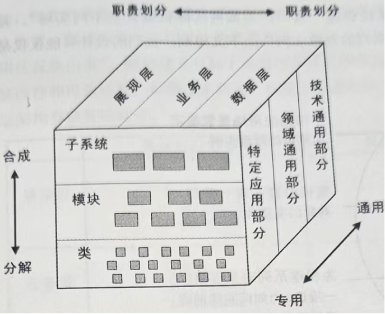
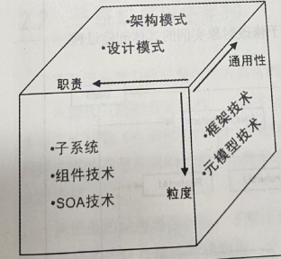
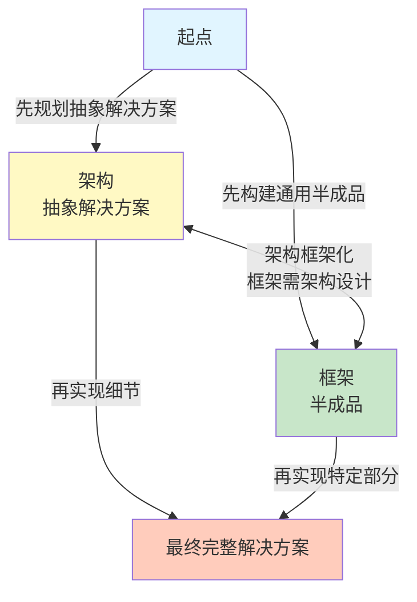
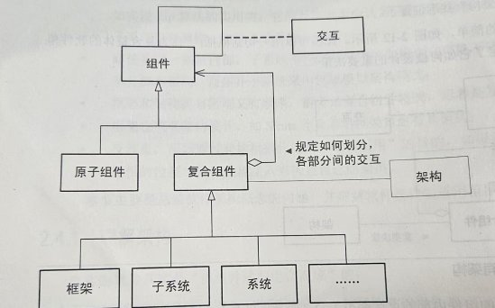
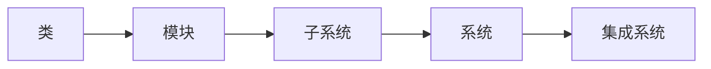
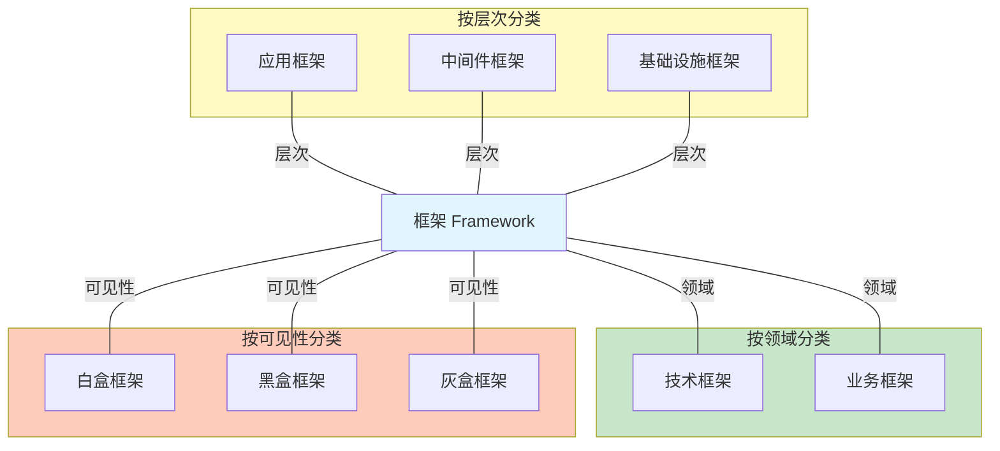
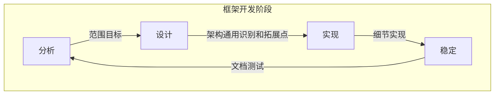

# 软件架构设计

**作者**：温昱  
**出版社**：电子工业出版社  

---
# 软件架构概念及思想篇

## 第一章：软件架构概念解析

###  软件架构的定义

#### 组成派观点
- 架构是由计算组件及其交互组成的系统描述
- 强调架构的**结构组成**和**组件关系**

#### 决策派观点
- 架构是关于系统设计决策的集合
- 强调架构的**设计决策**和**权衡过程**
- 决策派注重其他特性、使用、功能性、性能、弹性、重用、可理解性、经济和技术的限制和权衡以及美学。


### 决策派思路，重点在于决策，而不是组成

```
 系统 -> 嵌入式应用
      └────> 桌面应用 -> 应用层
                └────> 通讯层
```

## 第二章：架构设计方法

###  子系统和框架在架构设计中的地位

> 软件界是新名词制造工厂，需要理清概念之间的关系

**架构设计关注点分离模型：**



**技术谱（Technology Spectrum）：**



###  子系统和框架的关系

#### 核心观点
- **子系统**和**框架**两个概念相辅相成
- 子系统关注**职责划分**和**功能分解**
- 框架关注**通用性**和**可复用性**
- 两者在架构设计中处于不同维度，但相互补充

#### 设计模式的特点
- 无论是架构模式还是设计模式，重点关注的都是：
  - **上下文（Context）**
  - **问题（Problem）**
  - **解决方案（Solution）**
- 例如：抽象工厂（Abstract Factory）设计模式
  - 关注**对象的实例化**
  - 适用于**不同的应用场景**


#### 框架技术
- 框架技术有助于把**通用的关注点**和**专用关注点**分离出来
- 带来更好的**修改性**和**可重用性**
- 框架关注**通用性**和**可复用性**

#### 子系统
- 分层、MVC、管道过滤器等架构模式应该**结合使用**或**子系统层化划分嵌套使用**
- 子系统关注**职责划分**和**功能分解**

###  软件分解场景

#### 分解层次
```
类 → 模块 → 子系统 → 系统 → 集成系统
```

#### 关键概念
- **系统**：多个元素组成的逻辑实体
- **子系统**：特殊的系统，是系统的一部分
- **递归组合**：真实的软件是由组件递归组合而成

###  子系统

#### 子系统的特点
- 系统就是多个元素组成的逻辑实体
- 子系统是特殊的系统，子系统是系统的一部分
- 如果子系统过于复杂也需要架构设计
- 子系统不同，架构设计也不同

#### 子系统的视角（黑盒 vs 白盒）
- **高一级架构设计时**：子系统是一个**黑盒单元**
  - 只关注子系统的接口和职责
  - 不关心内部实现细节
- **子系统一级架构设计时**：子系统是一个**结构复杂的白盒**
  - 需要设计子系统内部的组件和交互
  - 关注子系统内部的架构

> **关键观点**：细节是相对而言的

### 框架

#### 框架的定义
> **框架是一种特殊的软件，架构不是软件**

> **框架是可以通过某种机制（回调机制）进行扩展的软件系统或子系统半成品**

#### 框架的特点
- 框架是**软件**（可执行的代码）
- 架构是**设计决策**（不是软件本身）
- 框架提供**扩展点**（通过回调机制）
- 框架是**半成品**，需要填充具体业务逻辑

###  架构和框架的联系

**架构和框架的开发流程：**



**流程说明：**
1. **起点**：软件开发开始
2. **架构（抽象解决方案）**：先规划抽象解决方案
3. **框架（半成品）**：先构建通用半成品
4. **双向关系**：
   - 架构 → 框架：将系统或子系统架构框架化
   - 框架 → 架构：框架也需架构设计（迭代优化）
5. **最终完整解决方案**：
   - 从架构：再实现细节
   - 从框架：再实现特定部分

#### 关键观点
> **真实的软件是由组件递归组合而成**

- 作为符合整体的软件单元才有架构
- 架构规定了它如何被设计的重要决策
- 在架构设计阶段没有必要关心分解软件单元内部细节
- 架构师对系统的抽象：
  - **公有的**：关注涉及元素之间如何交互
  - **大局**：关注大局，把握细节



---

## 关键概念总结

### 架构 vs 框架

| 维度 | 架构 | 框架 |
|------|------|------|
| **本质** | 设计决策的集合 | 特殊的软件 |
| **形式** | 不是软件 | 可执行的代码 |
| **关注点** | 如何设计系统 | 如何实现系统 |
| **扩展性** | 通过架构模式 | 通过回调机制 |
| **关系** | 架构可以指导框架设计 | 框架可以体现架构思想 |

### 子系统 vs 框架

| 维度 | 子系统 | 框架 |
|------|--------|------|
| **关注点** | 职责划分、功能分解 | 通用性、可复用性 |
| **视角** | 黑盒（高一级）或白盒（本级） | 半成品，需要填充 |
| **使用方式** | 直接调用 | 通过扩展点扩展 |
| **关系** | 相辅相成，不同维度 | 可以结合使用 |

### 软件分解颗粒



### 架构设计的核心原则

1. **关注点分离**：层次、粒度、通用性三个维度
2. **黑盒抽象**：高一级设计时，子系统是黑盒
3. **递归组合**：软件由组件递归组合而成
4. **大局把握**：关注元素间交互，把握大局和细节

### 框架分类

> 框架的粒度是介于系统和库之间的，是可复用的软件单元。

#### 框架的粒度层次


#### 框架的特点
- **粒度**：介于系统和库之间
- **可复用性**：可复用的软件单元
- **半成品**：需要填充具体业务逻辑
- **扩展性**：通过回调机制进行扩展

#### 框架的分类


#### 框架开发阶段



## 软件架构

### 软件架构的位置
- **上承业务目标**，为完成业务目标而进行大局规划
- **下接技术决策**，将面向业务需求转化为面向技术的架构设计方案
- **控制复杂性**，好的架构设计可以控制复杂性，使系统易于维护和扩展
- **组织开发**，架构设计决策可以把不同模块分配给不同小组并行开发，提升开发效率，扮演开发宪法角色。
- **迭代及增量交付**，架构有利于增量交付提供良好的基础
- **提高质量**，规划模块职能，清晰的接口

### 软件产品架构
- 为一系列相关产品而设计的通用架构。由于业务具有部分共同性，且明确许可的变化，所以需要使用产品架构提取公共部分，分离可变部分，提高架构可复用性。

产品架构通过以下方式提高可复用性
- **提取公共部分**：识别并抽象产品间的共性，形成核心架构
- **分离可变部分**：识别产品间的差异点，通过配置、参数化等方式实现可变性
- **建立可变点机制**：支持通过配置、插件、模板等方式快速定制产品

#### 软件架构重构
- 软件架构会磨损，当软件架变得混乱时，软件架构就需要**再工程**，需要经过**逆向工程**，**重新规划**，**正向工程**三个阶段。
- 合理的保留，不妥的修正。

# 软件架构设计方法及过程
